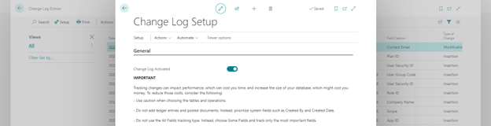
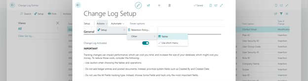
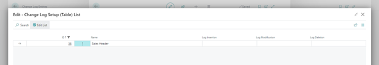
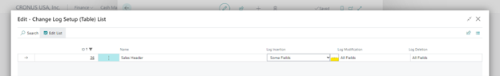
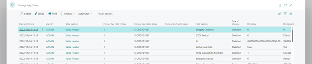

<<<<<<< HEAD:articles/D365BC Tech/how-to-enable-table-change-log-d365bc.md
---
title: D365BC でテーブルの変更ログを記録する方法
date: 2022-11-16
tags:
  - D365BC Tech
  - Change Log Setup
disableDisclaimer: false
---

こんにちは、Dynamics ERP サポートチームの細野です。  
この記事では、 Dynamics 365 Business Central (D365BC) においてテーブルの変更ログを記録、確認する方法を紹介します。
システムの要件としてデータの変更を追跡する必要がある場合や、発生事象の調査を進める中でいつ対象のレコードが作成 (編集、削除) されたのかを調べる必要がある場合などがあると思います。
そういった場合に活用いただける可能性のある機能となっております。

<!-- more -->
## 検証に用いた製品・バージョン
Dynamics 365 Business Central  
Version: W2 21.0  

## 対象テーブルの Change Log を有効化する手順
1. D365BC にブラウザでアクセスする

2. Change Log Setup を開く  
    

3. Change Log Activated を有効にする

4. Actions > Setup > Other > Tables とメニューを開き、クリックする
    

5. 追跡対象のテーブルを検索する (Sales Header の場合は ID : 36 となる)
    

6.	追跡対象のテーブルの追跡レベルを適宜設定する
    

> [!NOTE]
> 変更を追跡すると、パフォーマンスに影響を与える可能性があります。
> 重要なフィールドのみを追跡することが推奨されます。

7. Some Fields として設定した場合は、3 点リーダーより、追跡対象のフィールドを設定する
    
    

8.	設定が完了した後、Closeをクリックする
9.	バック ボタンをクリックし、以下のダイアログが表示された際に、Yes をクリックし、セッションをリスタートする
    

## Change Log を確認する方法
例. Sales Header を追跡対象とした場合
1. セッションがリスタートされた後、任意の Sales Order を削除する  
    

2. Change Log Entries を開く
3. 日付順に並び替え、ログを確認する
    

## 公開資料
本機能については、以下の公開資料においても紹介がございます。
あわせてご確認いただけますと幸いです。
https://learn.microsoft.com/en-us/dynamics365/business-central/across-log-changes

---
## おわりに  

以上、Dynamics 365 Business Central においてテーブルの変更ログを記録、確認する方法を紹介いたしました。  
=======
---
title: D365BC でテーブルの変更ログを記録する方法
date: 2022-11-16
tags:
  - D365BC Tech
  - Change Log Setup
disableDisclaimer: false
---

こんにちは、Dynamics ERP サポートチームの細野です。  
この記事では、 Dynamics 365 Business Central (D365BC) においてテーブルの変更ログを記録、確認する方法を紹介します。
システムの要件としてデータの変更を追跡する必要がある場合や、発生事象の調査を進める中でいつ対象のレコードが作成 (編集、削除) されたのかを調べる必要がある場合などがあると思います。
そういった場合に活用いただける可能性のある機能となっております。

<!-- more -->
## 検証に用いた製品・バージョン
Dynamics 365 Business Central  
Version: W2 21.0  

## 対象テーブルの Change Log を有効化する手順
1. D365BC にブラウザでアクセスする

2. Change Log Setup を開く  
    

3. Change Log Activated を有効にする

4. Actions > Setup > Other > Tables とメニューを開き、クリックする
    

5. 追跡対象のテーブルを検索する (Sales Header の場合は ID : 36 となる)
    

6.	追跡対象のテーブルの追跡レベルを適宜設定する
    

> [!NOTE]
> 変更を追跡すると、パフォーマンスに影響を与える可能性があります。
> 重要なフィールドのみを追跡することが推奨されます。

7. Some Fields として設定した場合は、3 点リーダーより、追跡対象のフィールドを設定する
    
    

8.	設定が完了した後、Closeをクリックする
9.	バック ボタンをクリックし、以下のダイアログが表示された際に、Yes をクリックし、セッションをリスタートする
    

## Change Log を確認する方法
例. Sales Header を追跡対象とした場合
1. セッションがリスタートされた後、任意の Sales Order を削除する  
    

2. Change Log Entries を開く
3. 日付順に並び替え、ログを確認する
    

## 公開資料
本機能については、以下の公開資料においても紹介がございます。
あわせてご確認いただけますと幸いです。
https://learn.microsoft.com/en-us/dynamics365/business-central/across-log-changes

---
## おわりに  

以上、Dynamics 365 Business Central においてテーブルの変更ログを記録、確認する方法を紹介いたしました。  
>>>>>>> repoA/main:articles/BusCen-Platform/how-to-enable-table-change-log-d365bc.md
