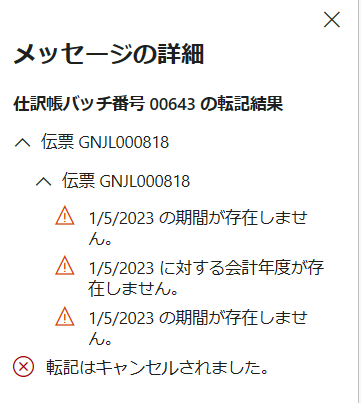
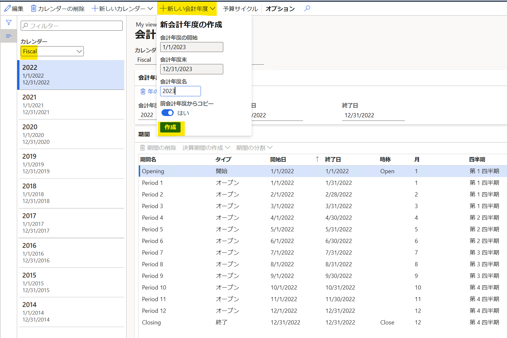

こんにちは、Dynamics ERP サポート チームの尾崎です。  
弊社標準環境のデモ データの法人の 1 つである USMF では 2023 年度より会計年度が未登録になっているバージョンがございます。
そのため、伝票を転記する際に以下のようなエラーが表示されることがあります。エラーが表示された際の会計年度の追加方法について紹介します。
<!-- more -->

## 検証に用いた製品・バージョン
Dynamics 365 Finance and Operations
Application version: 10.0.30 Platform version: PU54

## 会計カレンダー画面の起動
1. 一般会計 > カレンダー > 会計カレンダー へ遷移する
2. カレンダーを "Fiscal" に変更する
3. 「＋新しい会計年度」より作成ボタンをクリックする

## おわりに
弊社標準環境のデモ データの法人の 1 つである USMF にて会計年度が未登録になっていた際の会計カレンダー追加手順についてご案内いたしました。

