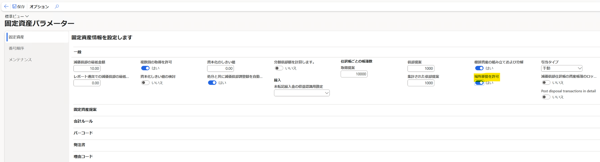
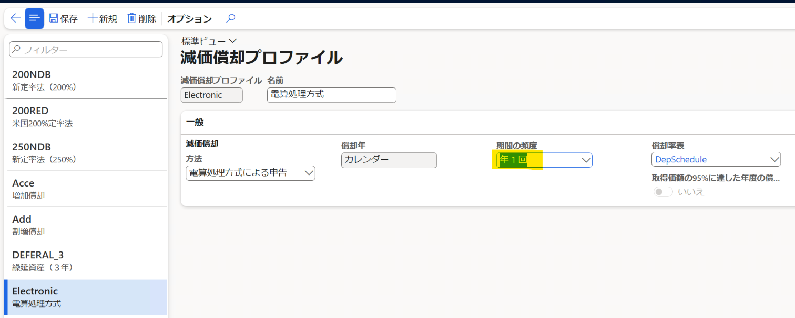
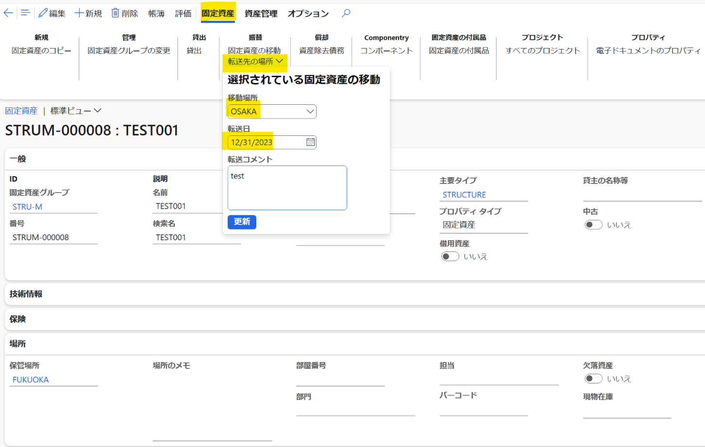

こんにちは、Dynamics ERP サポートチームの尾崎です。  
この記事では固定資産の保管場所を移動した際に、償却資産税申告書に移動結果が反映されない事象についてご案内します。

## 更新履歴
2023 年 3 月 20 日 (月) : ブログ公開

## 検証に用いた製品・バージョン
Dynamics 365 Finance and Operations
Application version: 10.0.32 Platform version: PU56

## 事象の再現手順
弊社標準環境 JPMF を使用した事象の再現手順は以下のようになっております。
1. 固定資産パラメーターにて場所移動を許可します。

2. 減価償却プロファイルにて電算処理方式の期間の頻度を年 1 回に変更します。

3. 固定資産の作成を行います。帳簿には Form26 を含むようにします。
4. 作成した固定資産を取得し、減価償却を行います。
5. 固定資産の場所を移動します。転送先の場所を押下後、移動場所と転送日を入力し更新します。

6. 固定資産の場所移動を確定後、申告 26 レポートを起動します。
　固定資産 > 照会およびレポート > 減価償却資産申告レポート > 申告 26: 償却資産税の元帳レポート

7. レポートを出力すると場所移動前の市区町村にて出力される事象が確認できます。
　また本事象は以下 2 つのレポートでも発生することを確認しております。
　申告 26 - 1: 全資産および増加資産のタイプごとの詳細レポート
　申告 26 - 2: 減少資産のタイプごとの詳細レポート

## 修正方針
場所の移動結果が正しくレポートに反映されるよう修正を行う方針でございます。

## 今後のタイムライン
バージョン 10.0.35 にて修正プログラムがリリースされる予定でございます。
※リリース予定のバージョンは変更される場合がございます。予めご了承ください。

## おわりに  
以上、固定資産の保管場所を移動した際に、償却資産税申告書に移動結果が反映されない事象についてご案内いたしました。
より詳細な情報が必要な場合、弊社テクニカルサポート、貴社担当のアカウントマネージャー (CSAM, PSAM)、弊社営業、およびクラウドソリューションアーキテクト (CSA-E) までお問い合わせください。