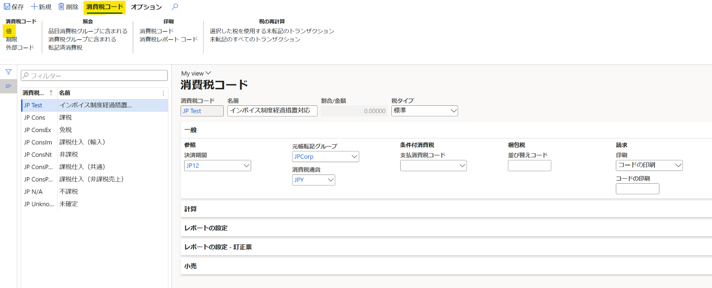
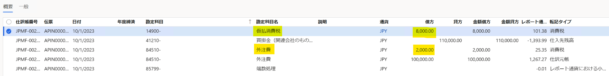

こんにちは、Dynamics ERP サポートチームの尾崎です。  
この記事では、 2023 年 10 月 1 日より開始される適格請求書等保存方式 (インボイス制度) において生じる
免税事業者などに対する経過措置について Dynamics 365 Finance and Operations (D365FO) における登録方法をご紹介します。
こちらの記事でご紹介する登録方法では消費税コードに非控除割合を設定することで、経過措置期間中の仕入税額控除とみなすことのできる割合を管理します。非控除割合を登録していただくことで、非控除分の金額が費用科目として転記されるようになります。

なお制度の詳細については国税庁ホームページをご確認ください。
[No.6498 適格請求書等保存方式（インボイス制度）](https://www.nta.go.jp/taxes/shiraberu/taxanswer/shohi/6498.htm)

<!-- more -->

## 検証に用いた製品・バージョン
Dynamics 365 Finance and Operations
Application version: 10.0.31
Platform version: PU 55

## 消費税コードの設定
1. 税金 > 間接税 > 消費税 > 消費税コード を起動します。
2. 非控除割合を設定するためのの消費税コードを新規作成します。
3. コード、名称、決済期間、元帳転記グループなどに任意の値を登録します。
4. 消費税コード > 値 を起動します。

5. 仕入税額とみなすことのできない割合を非控除に登録します。

6. 登録した消費税コードを呼出可能にするため、消費税グループおよび品目消費税グループにおいて追加設定します。

## 設定結果
上記設定を元に仕入先請求書を転記した結果、伝票は以下のようになります。
非控除に設定した割合が費用として転記されていることをご確認いただけます。

## おわりに  
以上、免税事業者などに対する経過措置について Dynamics 365 Finance and Operations (D365FO) における登録方法についてご案内いたしました。
より詳細な情報が必要な場合、弊社テクニカルサポート、Customer Success Account Manager (CSAM), Customer Engineer (CE) までお問い合わせください。
