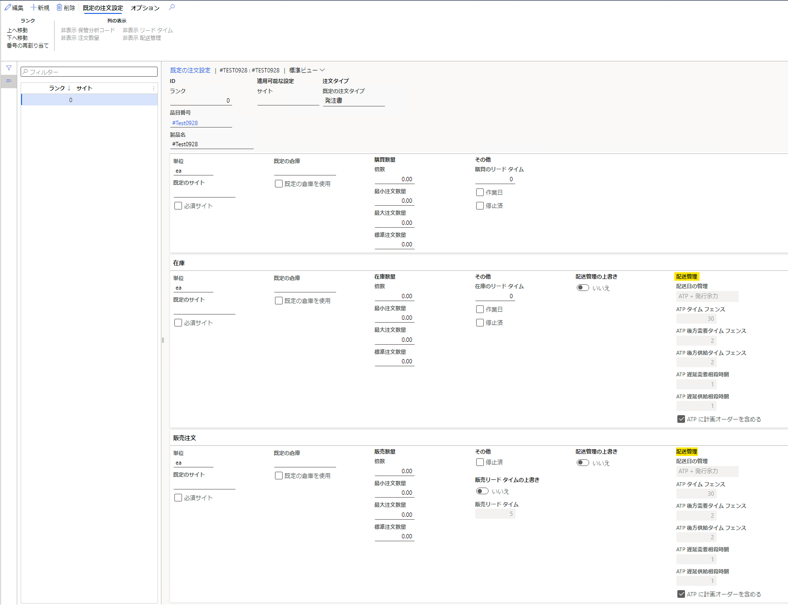
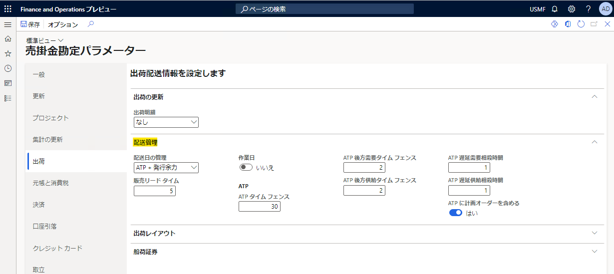

こんにちは、Dynamics ERP サポートチームの木村です。  
この記事では、 Dynamics 365 Finance and Operations における[既定の注文設定] の[購買管理] フィールド取得元について紹介します。

<!-- more -->
## 目次

1. [検証に用いた製品・バージョン](#anchor-version)
2. [[既定の注文設定] の[購買管理] フィールド取得元について](#how-to-correct-deliverycontroldata)
3. [おわりに](#anchor-finish)

## 検証に用いた製品・バージョン
Dynamics 365 Finance and Operations      
Application version: 10.0.29   
Platform version: PU53  

## [既定の注文設定] の[購買管理] フィールド取得元について
### 対象の項目は以下の画像の箇所となる
1. 製品情報管理 > 製品 > リリースされた製品 を順にクリックする
2. 在庫の管理 > 注文設定 > 既定の注文設定  を順にクリックする

### 取得元について
1. 売掛金管理 > 設定 > 売掛金勘定パラメーター を順にクリックする
2. [出荷] をクリックする

※ 上記画像の[配送管理] に設定している内容が[既定の注文設定] に引き継がれます  

---
## おわりに  

以上、 Dynamics 365 Finance and Operations における[既定の注文設定] の[購買管理] フィールド取得元について紹介いたしました。
より詳細な情報が必要な場合、弊社テクニカルサポート, Customer Success Account Manager (CSAM), Customer Engineer (CE) までお問い合わせください。
