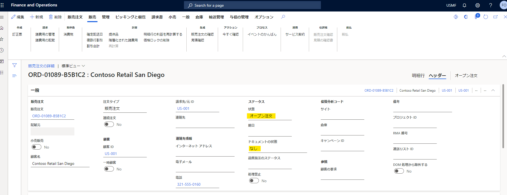
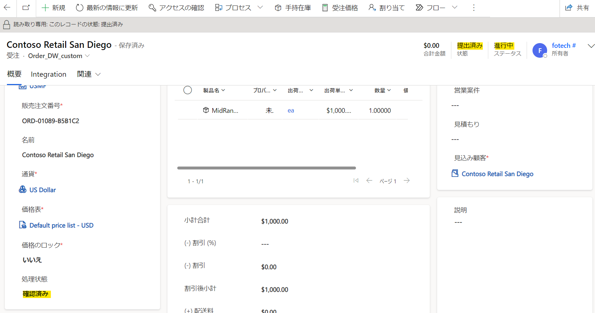
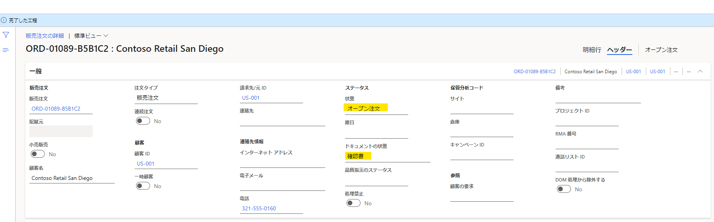
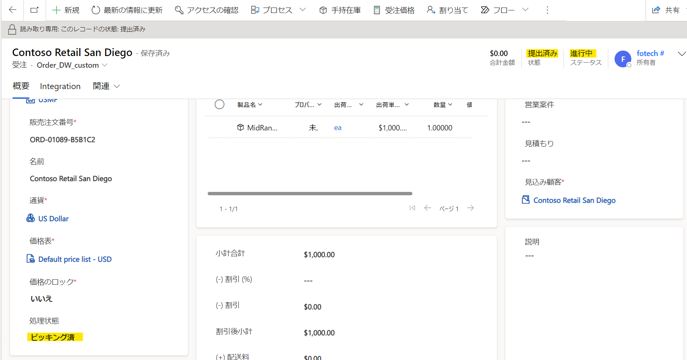
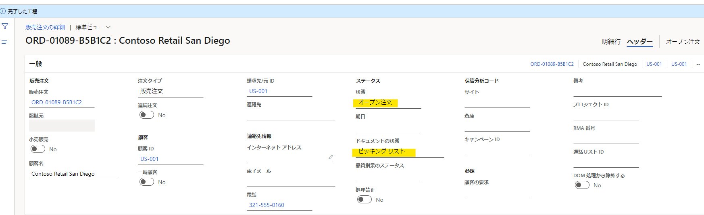
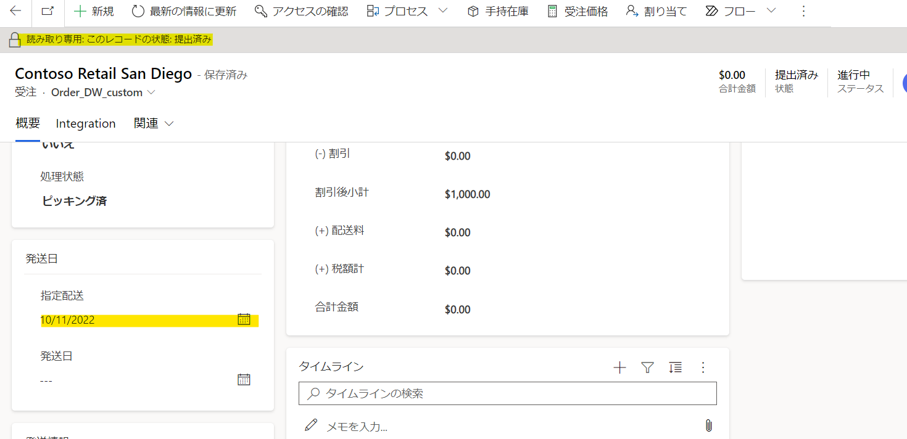

こんにちは、日本マイクロソフト Dynamics ERP サポートチームの呉です。  
この記事では、 Dynamics 365 Finance and Operations (D365FO) と Dynamics 365 Customer Engagement (D365CE) を Dual Write で連携している環境にて、販売注文のピッキングリストを削除しても D365CE 側の受注データの配送日が変更できない挙動について紹介します。

<!-- more -->
## 更新履歴
2022 年 10 月 14 日 (金) : ブログ公開

## 目次
- [検証に用いた製品・バージョン](#検証に用いた製品・バージョン)

## 検証に用いた製品・バージョン
Dynamics 365 Finance and Operations      
Application version : 10.0.26  
Platform version : PU50  

Dynamics 365 Customer Engagement  
Database version : 9.2.22093.00194  
Release : 2022 release wave 2  

## 事象の再現手順
1. D365CE にて受注データを作成し、製品を 1 行追加する  
    - D365CE
        - 受注ステータス : 「アクティブ」
        - 処理状態 : 「アクティブ」  
        
    - D365FO
        - 販売注文ヘッダーの状態 : 「オープン注文」
        - ドキュメントの状態 : 「なし」  
        

2. D365FO にて販売注文を確定する
    - D365CE
        - 受注ステータス : 「アクティブ」から「提出済み」
        - 処理状態 : 「アクティブ」から「確認済み」
        
    - D365FO
        - 販売注文ヘッダーの状態 : 「オープン注文」
        - 処理状態 : 「なし」から「確認書」
        

3. D365FO にてピッキング処理を実施する
    - D365CE
        - 受注ステータス : 「提出済み」
        - 処理状態 : 「確認済み」から「ピッキング済み」
        
    - D365FO
        - 販売注文ヘッダーの状態 : 「オープン注文」
        - 処理状態 : 「確認書」から「ピッキングリスト」
        

4. D365FO にてピッキングリストを削除する
    - D365CE
        - 受注ステータス : 「提出済み」
        - 処理状態 : 「ピッキング済み」
    - D365FO
        - 販売注文ヘッダーの状態 : 「オープン注文」
        - 処理状態 : 「ピッキングリスト」
        

## 発生する事象
D365CE の受注データが読み取り専用となり、配送日の変更ができない状態になる。

## 事象の発生原因
D365FO の販売注文のドキュメントステータスが「確認書」または「ピッキングリスト」の場合、D365CE のステータスが「アクティブ」ではなく「提出済み」であるため、データが読み取り専用となります。
### 現在のマッピング
|処理状態|D365FO の状態|D365FO のドキュメントの状態|D365CE のステータス|
|:---|:---|:---|:---|
|アクティブ|オープン注文|なし|アクティブ|
|確認済み|オープン注文|確認書|提出済み|
|ピッキング済|オープン注文|ピッキングリスト|提出済み|
|一部出荷済|オープン注文|梱包明細|アクティブ|
|一部請求済|オープン注文|請求書|アクティブ|
|出荷済|出荷済|梱包明細|履行済|
|請求済|請求済|請求書|請求済|
|キャンセル済|取消済|なし|キャンセル|

(参考情報)  
[販売注文の状態列のマッピングを設定する](https://learn.microsoft.com/ja-jp/dynamics365/fin-ops-core/dev-itpro/data-entities/dual-write/sales-status-map)

## 修正方針
D365FO の販売注文のドキュメントステータスが「確認書」または「ピッキングリスト」の場合、D365CE のステータスを「アクティブ」になるようにマッピングを変更する予定です。  
また、本件の改善と直接的な関係はありませんが、処理状態に「出荷済、一部請求済」を新たに追加する予定です。  

### 修正後のマッピング  
|処理状態|D365FO の状態|D365FO のドキュメントの状態|D365CE のステータス|
|:---|:---|:---|:---|
|アクティブ|オープン注文|なし|アクティブ|
|確認済み|オープン注文|確認書|<mark>アクティブ</mark>|
|ピッキング済|オープン注文|ピッキングリスト|<mark>アクティブ</mark>|
|一部出荷済|オープン注文|梱包明細|アクティブ|
|一部請求済|オープン注文|請求書|アクティブ|
|出荷済|出荷済|梱包明細|履行済|
|<mark>出荷済、一部請求済</mark>|<mark>出荷済</mark>|<mark>請求書</mark>|<mark>履行済</mark>|
|請求済|請求済|請求書|請求済|
|キャンセル済|取消済|なし|キャンセル|

## 今後のタイムライン
D365FO の 10.0.34 にてリリースされる予定です。  

## おわりに
現在確認されている販売注文の状態のマッピング変更についてご案内いたしました。  
今後リリース内容やリリース予定がアップデートされ次第、本ブログにて内容を公開・更新いたします。