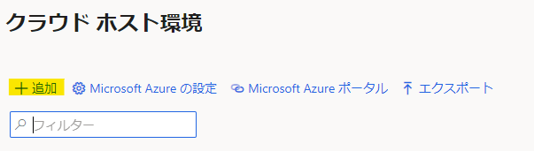
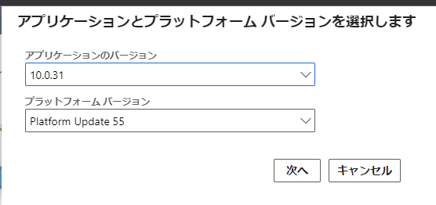
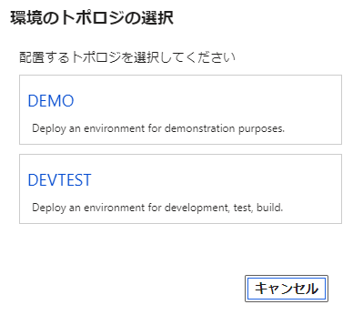
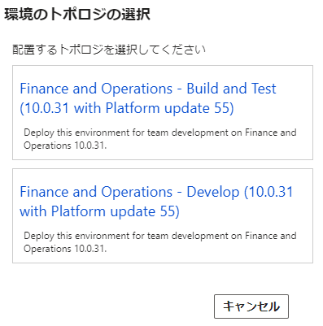
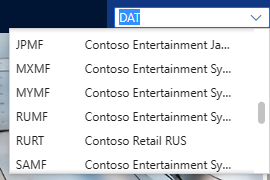

こんにちは、Dynamics ERP サポートチームの永吉です。  
この記事では、 Dynamics 365 Finance and Operations にて、 デモデータを含んだ環境の構築方法と検証シナリオ毎のおすすめ法人を紹介します。

<!-- more -->
## 検証に用いた製品・バージョン
Dynamics 365 Finance and Operations  
Application version: 10.0.31  
Platform version: PU55

## デモデータを含んだ環境構築方法
以下の公開資料を基に記載しています。  
[デモ環境の配置 - Finance & Operations | Dynamics 365 | Microsoft Learn](https://learn.microsoft.com/ja-jp/dynamics365/fin-ops-core/dev-itpro/deployment/deploy-demo-environment#deploy-a-demo-environment-1)

1. LCS でクラウドホストの構築画面まで進む  
実装プロジェクトの場合 : プロジェクト画面 > ハンバーガーボタン > クラウド ホスト環境 > [+ 追加] ボタン  
非実装プロジェクトの場合 : プロジェクト画面 > [+] ボタン または ハンバーガーボタン > クラウド ホスト環境 > [+ 追加] ボタン  
  

1. 任意のバージョンを選択し、[次へ] をクリックする  
  

1. 環境のトポロジとして [DEVTEST] をクリックする  
  ※ 実際の利用目的によって [DEMO] を選択いただいても構いません。  
  

1. 環境のトポロジとして [Develop] をクリックする  
  ※ 実際の利用目的によって [Build and Test] を選択いただいても構いません。  
  

1. 使用する Azure コネクタを選択する  
  ※ プロジェクトに対して 1 つのコネクタしか存在しない場合、本画面はスキップされます。

1. 環境の配置画面にて [詳細設定] > [Customize SQL Database Configuration] > [AX DATABASE (DEVELOPER VM)] を [Demo] に設定する
  
  

1. その他必要事項を入力し、環境を構築する

1. 構築後、法人を選択する画面にて以下で紹介する法人がリストされていれば成功です  
  

## 検証シナリオ毎のおすすめ法人
テクニカル サポート チームでは検証時にそれぞれの検証目的に合わせて使用する法人を決めています。  
以下の法人がそれぞれの検証シナリオにおけるオススメの法人となりますため、ご参考になれば幸いです。  
<table>
<thead>
<tr><th>法人 (Legal Entity)<th>検証目的
</thead>
<tbody>
<tr><td>USMF<td>基本的な挙動の検証
<tr><td>JPMF<td>日本ローカライズ機能の検証
<tr><td>DEMF<td>会社間取引の検証
<tr><td>USRT<td>Commerce の検証
<tr><td>USSI<td>プロジェクト マネジメントの検証
<tr><td>USPM<td>Project Operations の検証
<tr><td>CNMF<td>中国ローカライズ機能の挙動の検証
<tr><td>THMF<td>タイのローカライズ機能の検証
<tr><td>INMF<td>インドのローカライズ機能の検証
</tbody>
</table>

---
## おわりに  
以上、 Dynamics 365 Finance and Operations にて、 デモデータを含んだ環境の構築方法と検証シナリオ毎のおすすめ法人についてご紹介しました。
