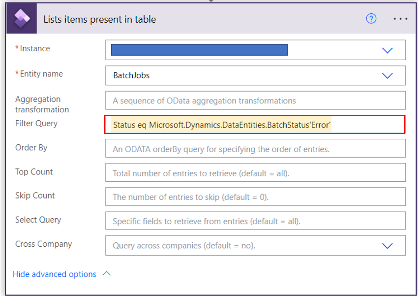
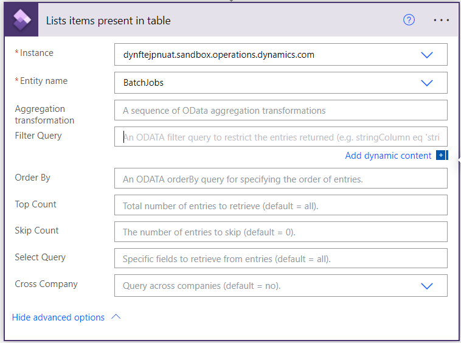
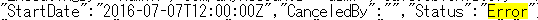
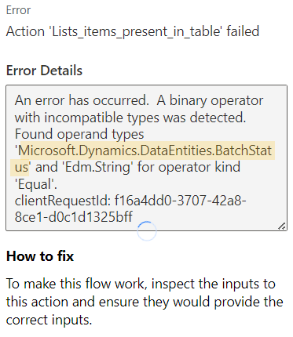

こんにちは、日本マイクロソフトの佐藤です。
この記事では、Power Automate の Fin&Ops Apps (Dynamics 365) コネクタにおけるフィルターの設定方法をご案内します。
この手順により、Power Automate から Dynamics 365 for Finance and Operations (D365FO) 環境にアクセスしてテーブル情報を取得する際に、フィルターを適用し、必要な情報だけを取得することができます。  

<!-- more -->
## 検証に用いた製品・バージョン
Dynamics 365 Finance and Operations
Application version: 10.0.30
Platform version: PU54

## PowerAutomate の Fin&Ops Apps(Dynamics365) コネクタにおけるフィルターの設定方法

例えば、ステータスが 'エラー' である Batch ジョブだけの情報を取得したい場合は、下記のようにフローを設定することで、情報を取得できます。

```javascript
Status eq Microsoft.Dynamics.DataEntities.BatchStatus'Error'
```


上記のうち、テーブル列名 (*1) eq Microsoft.Dynamics.DataEntities.***(*2) '値(*3)'
にあたる 3 つは取得したいデータに併せて設定する必要があります。

## List items present in table のフィルタークエリの設定 (*1 *3)
まずテーブル列名 (*1) とその値 (*3) の参照方法を説明いたします。いくつか方法はございますが、本 Blog では PowerAutomate を使用した方法を 1 つ紹介いたします。

1. 「テーブルに存在する項目を一覧表示する」のコネクタにて、参照したいエンティティに関してフィルターを設定せずに一度テストを実行します。


2. テスト終了後、実行履歴からダウンロード取得したデータをダウンロードします。


3. データを開き、取得したいデータを検索すると "Status" という列名に "Error" という情報で格納されていることがわかります。


## List items present in table のフィルタークエリの設定 (*2)
続いて、Microsoft.Dynamics.DataEntities. の後の (*2) について PowerAutomate を使用した参照方法を説明いたします。

1. 「テーブルに存在する項目を一覧表示する」のコネクタにて、参照したいエンティティに関して、上記の手順で判明した (*1) と (*3) を用いてフィルターを設定します。その後テストを実行します。


2. テスト終了後、実行履歴を確認するとテストは失敗しているはずです。この失敗は想定の挙動ですので問題ございません。エラーの内容を確認すると下記のようにエラーが表示されます。


3. 上記のエラーで表示された Microsoft.Dynamics.DataEntities. の後の文字列 ( 今回は BatchStatus ) を (*2) の値として使用します。
すると下記のような設定となり、データのフィルタリングができます。


## OData のサービスエンドポイント使用時のフィルター設定
本ブログのフィルター設定を OData のサービスエンドポイント使用時に実行する場合は、下記のように設定します。

```javascript
https://dynftejpnuat.sandbox.operations.dynamics.com/data/BatchJobs?$filter=Status eq Microsoft.Dynamics.DataEntities.BatchStatus'Error'
```
その他のクエリオプションの設定に関しましては、下記の公開資料に記載がございますので、ご参照いただけますと幸いです。

[データ プロトコル (OData) を開く](https://learn.microsoft.com/ja-jp/dynamics365/fin-ops-core/dev-itpro/data-entities/odata)

---
## おわりに  

以上、、Power Automate の Fin&Ops Apps (Dynamics 365) コネクタにおけるフィルターの設定方法をご紹介させていただきました。
もし、お困りのこと等がございましたら、弊社までお問い合わせ頂きますようお願いいたします。  
