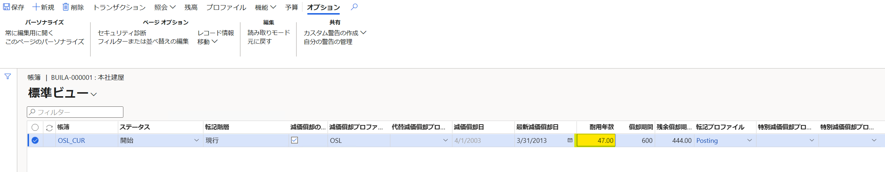

<<<<<<< HEAD:articles/D365FO App FIN/change-fixed-asset-service-life.md
---
title: 固定資産の耐用年数の変更方法について
date: 2023-1-5
tags:
  - D365FO
  - Fixed Assets
  - Japan localization

disableDisclaimer: false
---

こんにちは、Dynamics ERP サポート チームの尾崎です。  
固定資産パラメーターにて「減価償却方法を手動での変更を許可」を "はい" に設定している場合、[固定資産の帳簿画面] および [減価償却] タブ内に耐用年数が表示されなくなります。その際の耐用年数の変更手順について紹介します。
<!-- more -->
固定資産パラメーターについては以下のブログ記事をご参照ください。
[固定資産の帳簿に減価償却プロファイルを表示する方法](https://jpdynamicserp.github.io/blog/D365FO%20App%20FIN/show-depreciationprofile/)

## 検証に用いた製品・バージョン
Dynamics 365 Finance and Operations
Application version: 10.0.30 Platform version: PU54

## 固定資産の帳簿画面の起動
1. 固定資産を作成し、帳簿画面を起動する
2. 帳簿のハイパーリンクを押下する

3. 帳簿情報の一括変更画面が表示されたら、[編集] ボタンを押下する
4. 耐用年数を変更し、保存する

## おわりに  
以上、固定資産パラメーターにて「減価償却方法を手動での変更を許可」を "はい" に設定している場合における耐用年数の変更手順についてご案内いたしました。

=======
---
title: 固定資産の耐用年数の変更方法について
date: 2023-1-5
tags:
  - D365FO
  - Fixed Assets
  - Japan localization

disableDisclaimer: false
---

こんにちは、Dynamics ERP サポート チームの尾崎です。  
固定資産パラメーターにて「減価償却方法を手動での変更を許可」を "はい" に設定している場合、[固定資産の帳簿画面] および [減価償却] タブ内に耐用年数が表示されなくなります。その際の耐用年数の変更手順について紹介します。
<!-- more -->
固定資産パラメーターについては以下のブログ記事をご参照ください。
[固定資産の帳簿に減価償却プロファイルを表示する方法](https://jpdynamicserp.github.io/blog/FinOps-Finance/show-depreciationprofile/)

## 検証に用いた製品・バージョン
Dynamics 365 Finance and Operations
Application version: 10.0.30 Platform version: PU54

## 固定資産の帳簿画面の起動
1. 固定資産を作成し、帳簿画面を起動する
2. 帳簿のハイパーリンクを押下する

3. 帳簿情報の一括変更画面が表示されたら、[編集] ボタンを押下する
4. 耐用年数を変更し、保存する

## おわりに  
以上、固定資産パラメーターにて「減価償却方法を手動での変更を許可」を "はい" に設定している場合における耐用年数の変更手順についてご案内いたしました。

>>>>>>> repoA/main:articles/FinOps-Finance/change-fixed-asset-service-life.md
