こんにちは、Dynamics ERP サポートチームの木村です。  
この記事では、 Dynamics 365 Finance にて、申告 26: 償却資産税の元帳レポート (償却資産申告書 (償却資産課税台帳)) における電話番号の設定について JPMF のデモ データを利用して紹介します。

<!-- more -->

## 目次
1. [検証に用いた製品・バージョン](#anchor-version)
1. [手順 - 税理士等の氏名](#how-to-setup-certified-tax-accountant)
1. [手順 - 法人にあってはその名称及び代表者の氏名](#how-to-setup-external-legal-representative)
1. [手順 - この申告に応答する者の係及び氏名](#how-to-setup-contact-person)

## 検証に用いた製品・バージョン:
Dynamics 365 Finance and Operations  
Application version : 10.0.37  
Platform version : PU 61  
Legal entity : JPMF  

## 手順 - 税理士等の氏名

1. [組織管理] > [組織] > [法人] を押下する  
1. 対象の法人を選択 (デモ データの JPMF)
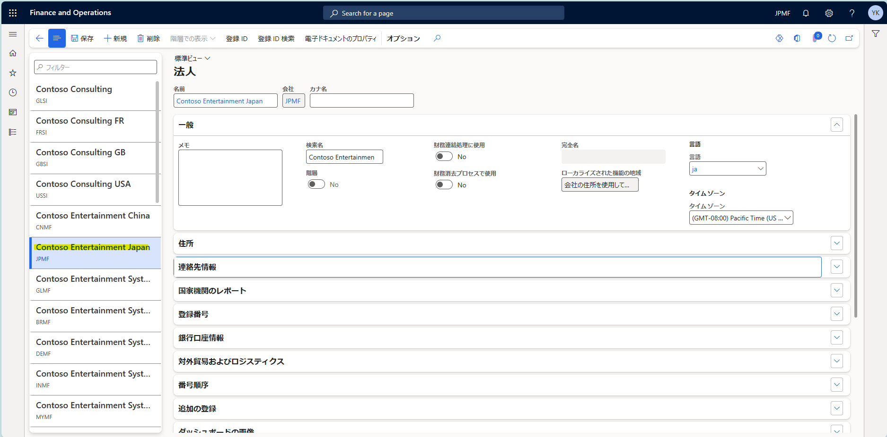  
1. [連絡先情報] タブにて [+追加] を押下し、任意のデータを登録する  
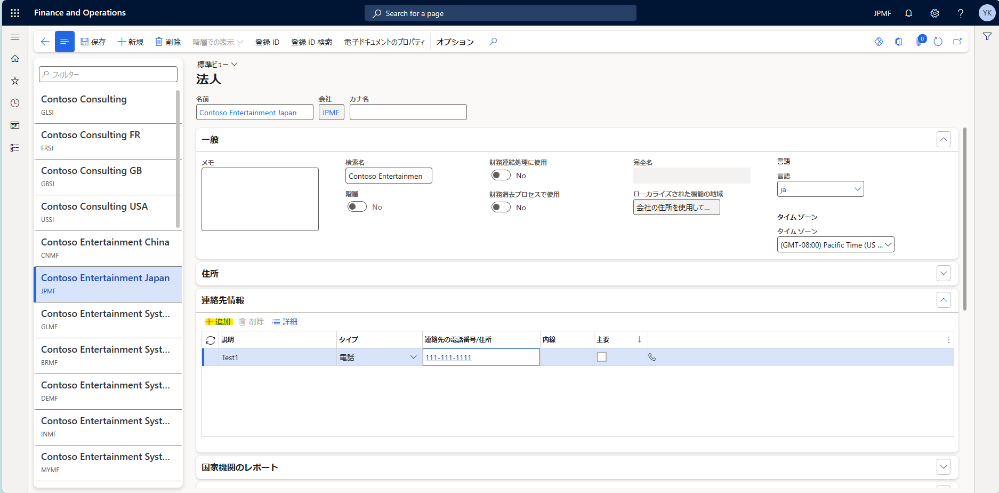  
1. [登録番号] タブの [税理士等の氏名] に上記で作成した連絡先を登録する
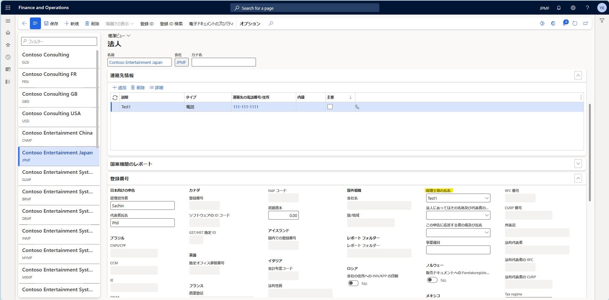  
1. [固定資産] > [照会およびレポート] > [減価償却資産申告レポート ] > [申告 26: 償却資産税の元帳レポート] を押下する  
1. 出力したいデータを入力し、出力する  
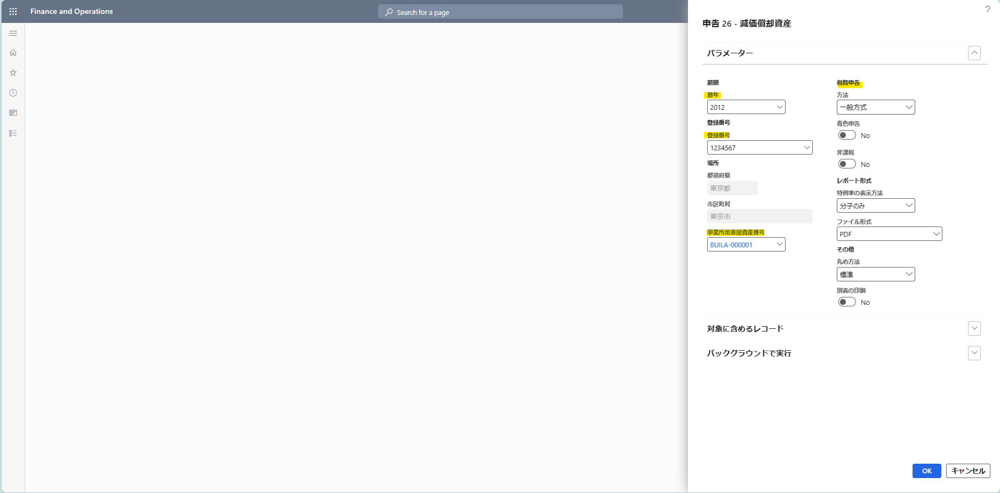  

### [税理士等の氏名] に連絡先情報で登録した内容が出力される
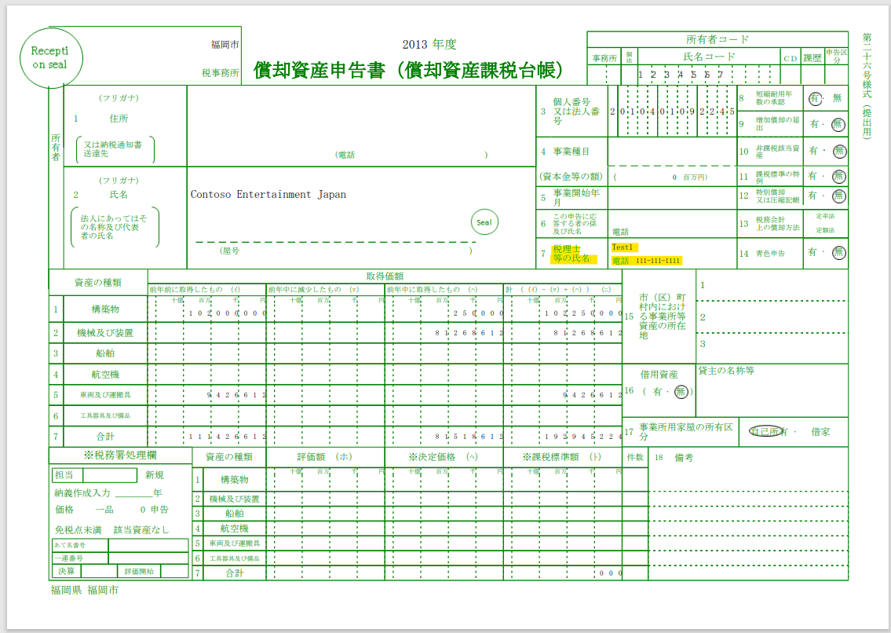  

## 手順 - 法人にあってはその名称及び代表者の氏名

1. [組織管理] > [組織] > [法人] を押下する  
1. 対象の法人を選択 (デモ データの JPMF)  
  
1. [連絡先情報] タブにて [+追加] を押下し、任意のデータを登録する  
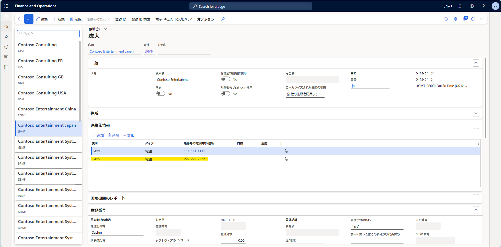  
1. [登録番号] タブの [法人にあってはその名称及び代表者の氏名] に上記で作成した連絡先を登録する  
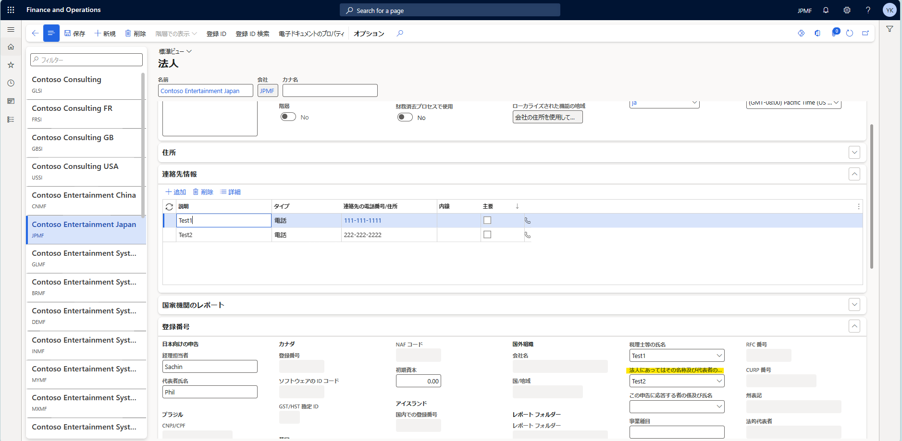  
1. [固定資産] > [照会およびレポート] > [減価償却資産申告レポート ] > [申告 26: 償却資産税の元帳レポート] を押下する  
1. 出力したいデータを入力し、出力する  
  

### [法人にあってはその名称及び代表者の氏名] 及び電話番号に連絡先情報で登録した内容が出力される
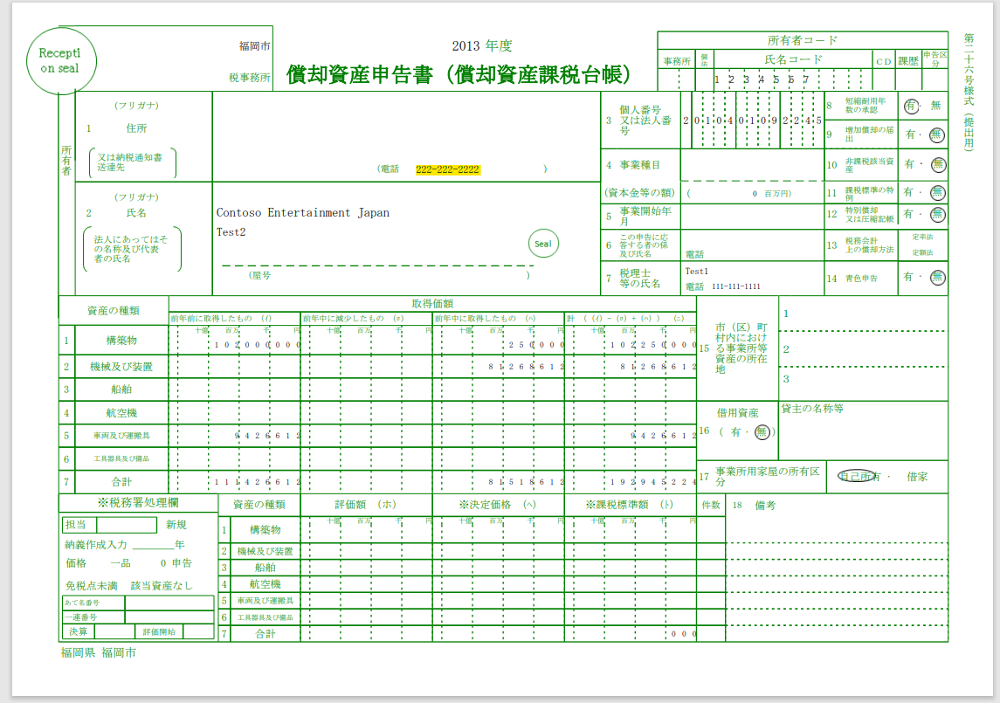  

## 手順 - この申告に応答する者の係及び氏名

1. [組織管理] > [組織] > [法人] を押下する  
1. 対象の法人を選択 (デモ データの JPMF)  
  
1. [連絡先情報] タブにて [+追加] を押下し、任意のデータを登録する  
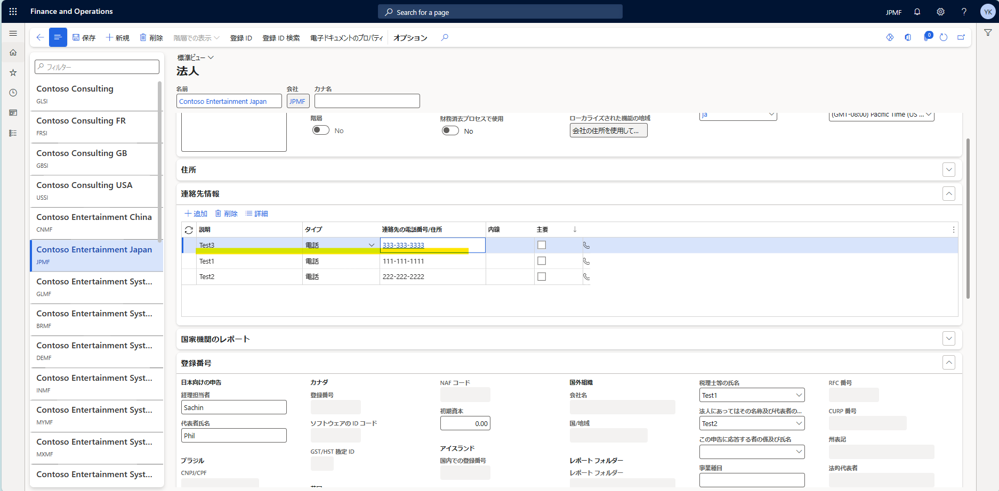  
1. [登録番号] タブの [この申告に応答する者の係及び氏名] に上記で作成した連絡先を登録する  
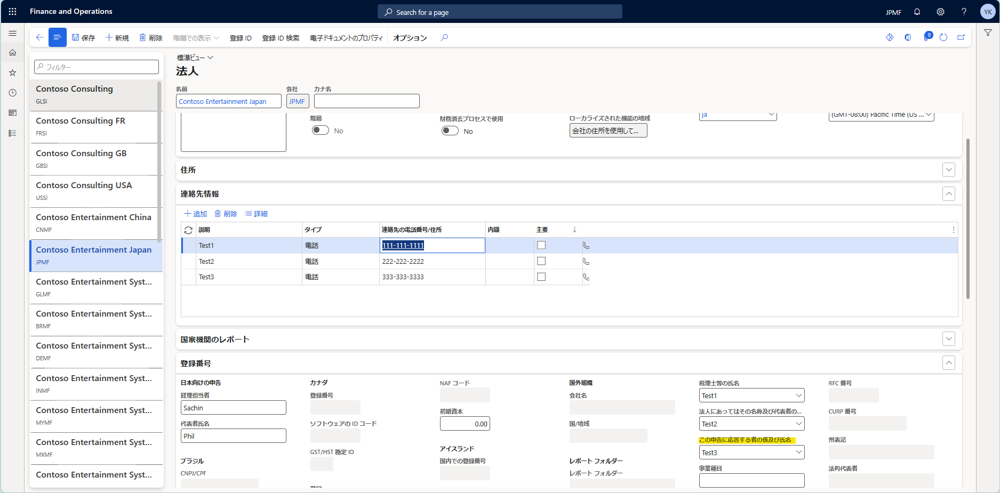  
1. [固定資産] > [照会およびレポート] > [減価償却資産申告レポート ] > [申告 26: 償却資産税の元帳レポート] を押下する  
1. 出力したいデータを入力し、出力する  
  

### [この申告に応答する者の係及び氏名] に連絡先情報で登録した内容が出力される
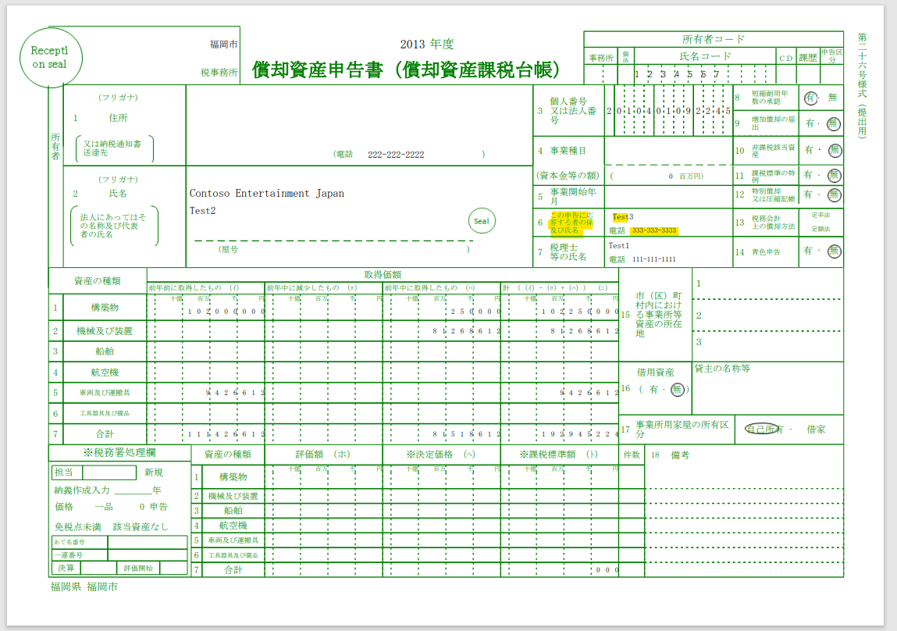  

---
## おわりに  
以上、申告 26: 償却資産税の元帳レポート (償却資産申告書 (償却資産課税台帳)) における電話番号などを出力する手順についてご紹介しました。
