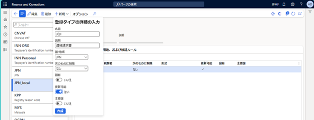
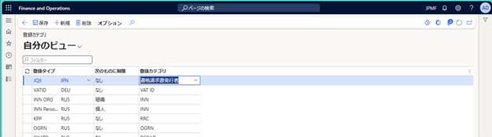
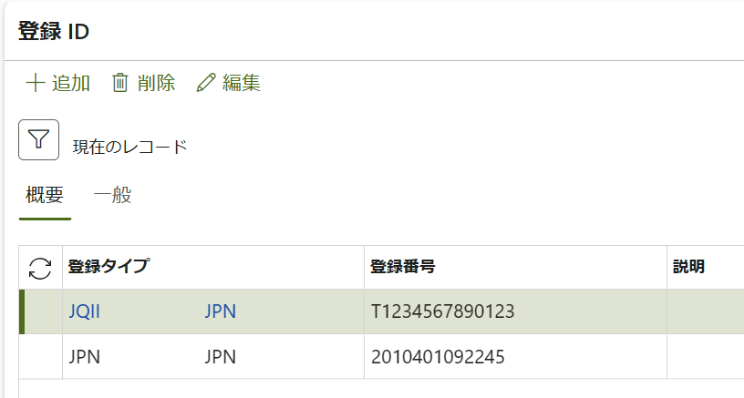
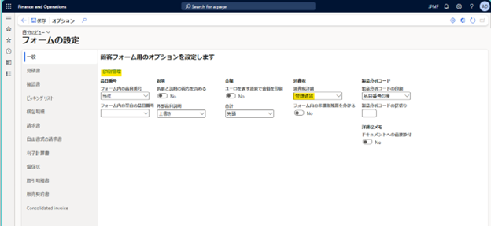
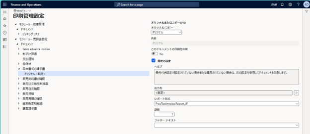
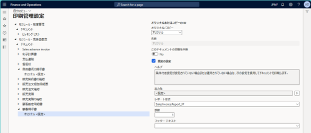
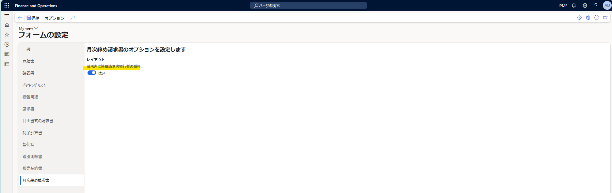
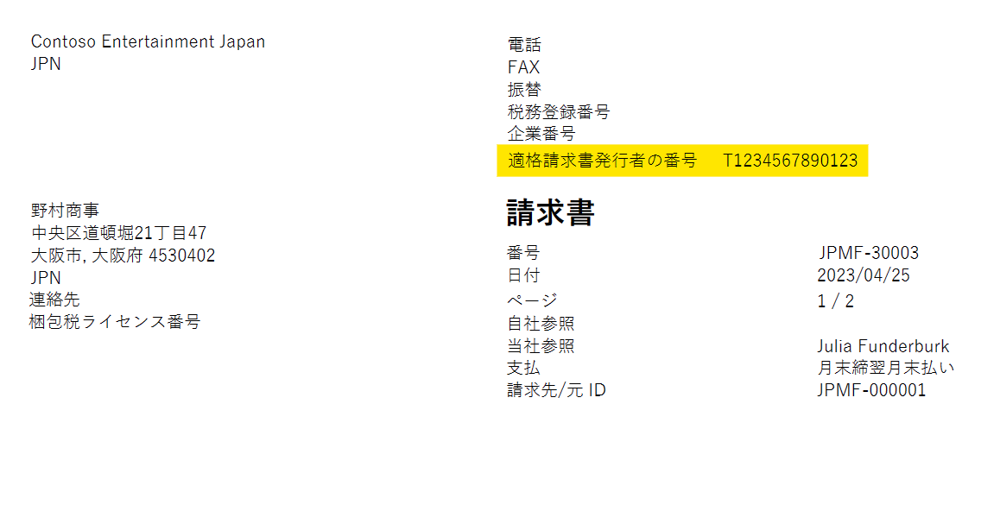
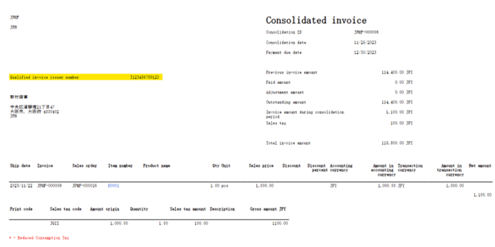

<<<<<<< HEAD
こんにちは、Dynamics ERP サポートチームの尾崎です。  
この記事では、 2023 年 10 月 1 日より開始される適格請求書等保存方式 (インボイス制度) における  
事業者番号を Dynamics 365 Finance and Operations (D365FO) に登録する方法および請求書に事業者番号を印字する方法をご紹介します。  
  
なお制度の詳細については国税庁ホームページをご確認ください。  
[No.6498 適格請求書等保存方式（インボイス制度）](https://www.nta.go.jp/taxes/shiraberu/taxanswer/shohi/6498.htm)

<!-- more -->

## 検証に用いた製品・バージョン
Dynamics 365 Finance and Operations  
Application version : 10.0.34  
Platform version : PU 58  
Legal entity : JPMF  

## 登録タイプの追加
1. [組織管理] > [グローバル アドレス帳] > [登録タイプ] > [登録タイプ] を起動します。
1. [＋新規] より [名前]、[国/地域]、[更新可能] を設定し作成します。

## 登録カテゴリの追加
1. [組織管理] > [グローバル アドレス帳] > [登録タイプ] > [登録カテゴリ] を起動します。
1. [＋新規] より [登録タイプ] に「登録タイプの追加」で追加した名前を選択し、[登録カテゴリ] に "適格請求書発行者" を設定します。

## 法人への登録番号の追加
1. [組織管理] > [組織] > [法人] を起動します。
1. ナビゲーション バーより [登録 ID] を開きます。
1. [登録 ID] タブより [＋追加] をクリックし、[登録タイプ] に「登録タイプの追加」で追加した名前を選択し、登録番号に適格請求書発行事業者としての登録番号を入力します。  
　※仕入先についても登録番号を同様の手順で追加することが可能になっています。

## 請求書への出力設定
1. [売掛金管理] > [設定] > [フォーム] > [フォームの設定] を起動します。
1. [請求書] タブにて [請求書に適格請求書発行者の番号を印刷] にチェックをいれます。
1. [自由書式の請求書] タブでも同様に [請求書に適格請求書発行者の番号を印刷] にチェックをいれます。
1. [請求書] タブに戻り、[印刷の管理] を起動します。
1. [自由書式の請求書] から [オリジナル <既定>] を選択し、[レポート形式] に "FreeTextInvoice.Report_JP" を選択します。
1. [顧客請求書] でも同様に [オリジナル <既定>] を選択し、[レポート形式] に "FreeTextInvoice.Report_JP" を選択します。  
　※本記事の執筆時点のバージョン 10.0.34 では上記 2 種類の請求書以外の請求書については未対応です。

## 設定結果
上記設定を元に請求書を出力すると以下のように登録した番号が印刷されることをご確認いただけます。

## おわりに  
以上、適格請求書等保存方式 (インボイス制度) における事業者番号を Dynamics 365 Finance and Operations (D365FO) に登録する方法および請求書に事業者番号を印字する方法をご案内いたしました。  
=======
こんにちは、Dynamics ERP サポートチームの木村です。  
この記事では、 2023 年 10 月 1 日より開始される適格請求書等保存方式 (インボイス制度) における  
事業者番号を Dynamics 365 Finance に登録する方法および請求書に事業者番号を印字する方法をご紹介します。  
  
なお制度の詳細については国税庁ホームページをご確認ください。  
[No.6498 適格請求書等保存方式（インボイス制度）](https://www.nta.go.jp/taxes/shiraberu/taxanswer/shohi/6498.htm)  

<!-- more -->

## 目次
1. [検証に用いた製品・バージョン](#anchor-version)
2. [公開資料について](#about-public-information)
3. [手順](#how-to-setup-qii)

## 検証に用いた製品・バージョン
Dynamics 365 Finance and Operations  
Application version : 10.0.37  
Platform version : PU 61  
Legal entity : JPMF  

## 公開資料について
下記にてご紹介した内容は、公開資料にも記載しております。  
英語のみの資料とはなりますが、併せてご参照ください。  
[Registration IDs - Finance | Dynamics 365 | Microsoft Learn](https://learn.microsoft.com/en-us/dynamics365/finance/localizations/europe/emea-registration-ids)  
[Qualified Invoice System in Japan - Finance | Dynamics 365 | Microsoft Learn](https://learn.microsoft.com/en-us/dynamics365/finance/localizations/japan/apac-jpn-qualified-invoice-system)  

## 手順
### 登録タイプの追加
1. [組織管理] > [グローバル アドレス帳] > [登録タイプ] > [登録タイプ] を起動します  
1. [＋新規] より [名前]、[国/地域]、[更新可能] を設定し作成します  
  

### 登録カテゴリの追加
1. [組織管理] > [グローバル アドレス帳] > [登録タイプ] > [登録カテゴリ] を起動します  
1. [＋新規] より [登録タイプ] に「登録タイプの追加」で追加した名前を選択し、[登録カテゴリ] に "適格請求書発行者" を設定します  
  

### 法人への登録番号の追加
1. [組織管理] > [組織] > [法人] を起動します  
1. ナビゲーション バーより [登録 ID] を開きます  
1. [登録 ID] タブより [＋追加] をクリックし、[登録タイプ] に「登録タイプの追加」で追加した名前を選択し、登録番号に適格請求書発行事業者としての登録番号を入力します  
　※ 仕入先についても登録番号を同様の手順で追加することが可能になっています。  
  

### 請求書への出力設定
1. [売掛金管理] > [設定] > [フォーム] > [フォームの設定] を起動します  
1. [請求書] タブにて [請求書に適格請求書発行者の番号を印刷] にチェックをいれます  
1. [自由書式の請求書] タブでも同様に [請求書に適格請求書発行者の番号を印刷] にチェックをいれます  
1. [請求書] タブに戻り、[印刷の管理] を起動します  

1. [自由書式の請求書] から [オリジナル <既定>] を選択し、[レポート形式] に "FreeTextInvoice.Report_JP" を選択します  
  
1. [顧客請求書] でも同様に [オリジナル <既定>] を選択し、[レポート形式] に "SalesInvoice.Report_JP" を選択します  
  
　※ 本記事の執筆時点のバージョン 10.0.37 では上記 2 種類の請求書以外の請求書については **未対応** です。
1. 月次締め請求書に適格請求書発行者の番号を印字したい場合には、[月次締め請求書] タブを選択し、[はい] を選択します  
  

### 設定結果
上記設定を元に請求書を出力すると以下のように登録した番号が印刷されることをご確認いただけます。  
**請求書の場合**  
  
  
**月次締め請求書の場合**  
  

## おわりに  
以上、適格請求書等保存方式 (インボイス制度) における事業者番号を Dynamics 365 Finance に登録する方法および請求書に事業者番号を印字する方法をご案内いたしました。  
>>>>>>> repoA/main
