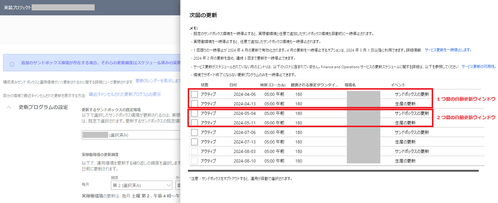
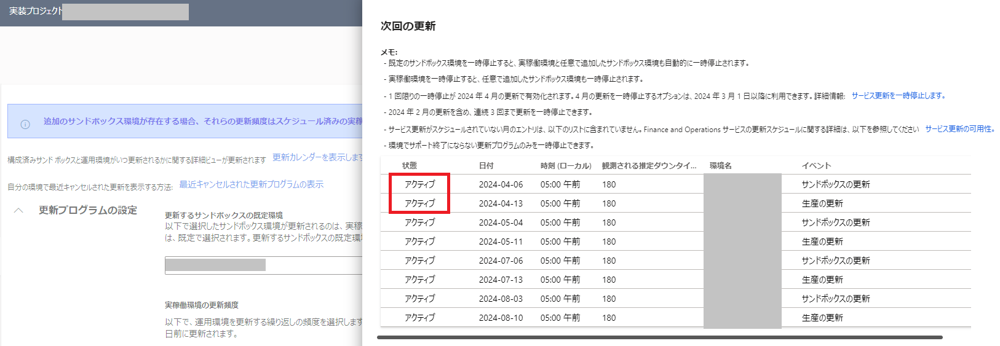
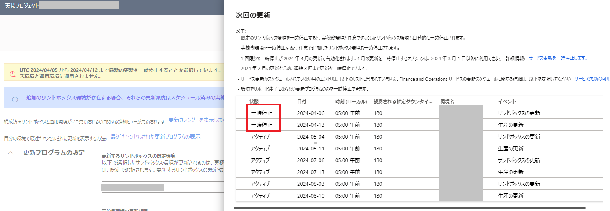
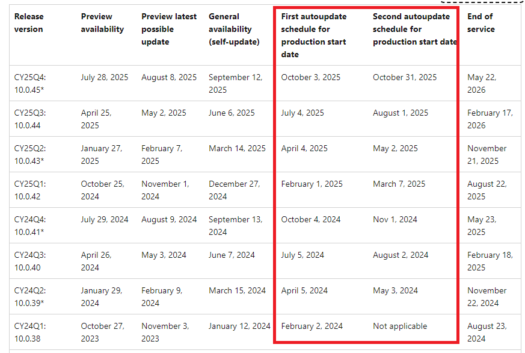

こんにちは、日本マイクロソフトの福原です。  
Dynamics 365 for Finance and Operations のバージョン 10.0.39 より導入されたサービス更新 (Service Update) の自動更新ウィンドウ (autoupdate window) のオプションについてご案内いたします。
このオプションにより自動更新の日程をより柔軟に選択できることができます。
<!-- more -->

## 検証に用いた製品・バージョン
Dynamics 365 Finance and Operations  
Application version: 10.0.39  
Platform version: PU63  

## サービス更新の自動更新ウィンドウのオプション
2024 年 3 月 19 日より、Dynamics 365 for Finance and Operations のバージョン 10.0.39 以降にて、サービス更新 (Service Update) の自動更新ウィンドウ (autoupdate window) のオプションが導入されました。
今までのバージョンでは、Microsoft によって設定された日程から 1 ヶ月以内に自動更新が適用されていましたが、このオプションにより自動更新の日程をより柔軟に選択できることができます。

例として、バージョン 10.0.38 では、2024 年 2 月 2 日から自動更新が開始され、 1 ヶ月以内に自動更新が適用されることになっていました。
しかし、バージョン 10.0.39 では、2024 年 4 月 5 日から始まる 1 つ目の自動更新ウィンドウ、または、2024 年 5 月 3 日から始まる 2 つ目の自動更新ウィンドウのいずれかを選択することができます。2024 年 5 月 3 日から始まる 2 つ目の自動更新ウィンドウを選択した場合には、2024 年 5 月 3 日からの 1 ヶ月以内に自動更新が適用されるようになり、GA (一般公開) の 2024 年 3 月 15 日から自動更新までの時間が以前よりも増えることとなります。

LCS のサービス更新の一時停止のページにて一時停止することによりウィンドウを選択することができます。

2024 年 4 月 5 日から始まる 1 つ目の自動更新ウィンドウは既定ではアクティブとなっています。

1 つ目の自動更新ウィンドウを一時停止した場合には 2024 年 5 月 3 日から始まる 2 つ目の自動更新ウィンドウにて 10.0.39 の自動更新が適用されます。

また、以下の公開資料でも、サービス更新の日程の表にて、First autoupdate schedule for production start date と Second autoupdate schedule for production start date の 2 つの列が追加されました。
https://learn.microsoft.com/en-us/dynamics365/fin-ops-core/dev-itpro/get-started/public-preview-releases?context=%2Fdynamics365%2Fcontext%2Fcommerce

---
## おわりに  

以上、Dynamics 365 for Finance and Operations のバージョン 10.0.39 より導入されたサービス更新 (Service Update) の自動更新ウィンドウ (autoupdate window) のオプションをご紹介いたしました。  