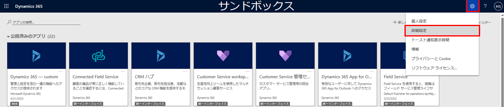
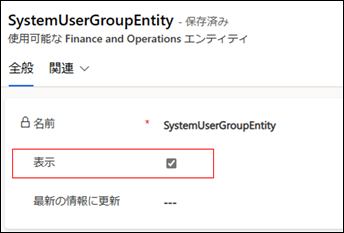

こんにちは、日本マイクロソフトの佐藤です。
この記事では、Power Automate でのデータ イベントのトリガー設定手順をご案内します。
この手順により、データの変更や更新が実行さえた際に Power Automate で検知できるようになります。

<!-- more -->
## 検証に用いた製品・バージョン
Dynamics 365 Finance and Operations
Application version: 10.0.33
Platform version: PU57

## 仮想エンティティの有効化
以下の手順は、下記の docs に記載されている内容を参照とした手順となっております。

[Microsoft Dataverse 仮想エンティティを有効化する](https://learn.microsoft.com/ja-jp/dynamics365/fin-ops-core/dev-itpro/power-platform/enable-virtual-entities)

まず、下記の手順でデータ イベントを作成したい仮想エンティティを有効化します。

1.	Power Platform 管理センターを開き、環境タブを選択します。
2.	環境の一覧で、Finance and Operations (FO) 環境に関連付けられている Power Platform 環境を選択します。
3.	環境ページの詳細セクションで環境 URL リンクを選択して Power Platform 環境を開きます。
4.	ページの右上で、設定のギア アイコンを開き、詳細設定を選択します。

5.	ページの右上で、設定ページを開き、高度な検索フィルター アイコンを選択します。

6.	高度な検索ページの検索対象ドロップダウン リストで、[使用可能な Finance and Operations エンティティ] を選択します。
エンティティの名前などの検索条件を入力し、結果を選択します。

7.	有効にするエンティティを開きます。

8.	[表示] チェック ボックスをチェックして、変更を保存します。

## Power Automate によるデータ イベントの検知
以下の手順は、下記の docs に記載されている内容を参照とした手順となっております。

[データ イベントの購読](https://learn.microsoft.com/ja-jp/dynamics365/fin-ops-core/dev-itpro/business-events/business-events-flow#subscribing-to-data-events)

右上の[環境] の選択から仮想エンティティを作成した Dataverse 環境を選択いただき、[行が追加、変更、または削除された場合] のDataverse コネクタのトリガーを作成しますと、[種類の変更] 項目が選択できますので、お客様の利用したい項目を選択します。

テーブル名では ”mserp” を検索いただけますと、有効化している仮想エンティティが検索できますので、仮想エンティティを選択します。

スコープは ”Organization” を選択します。

上記のトリガーにより、データイベントをトリガーとしてフローを実行できます。

---
## おわりに  
以上、Power Automate を使用したのデータ イベントのトリガー設定手順をご紹介させていただきました。
