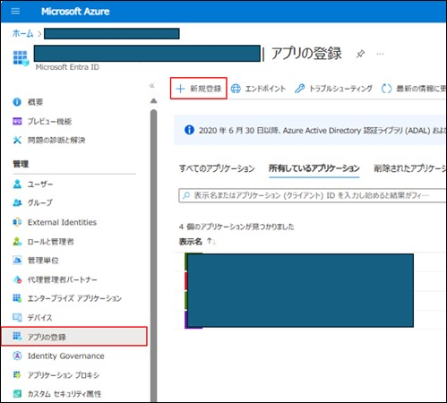
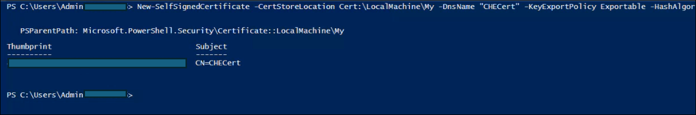
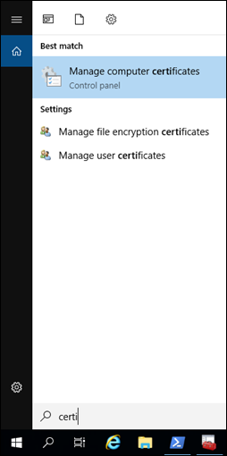
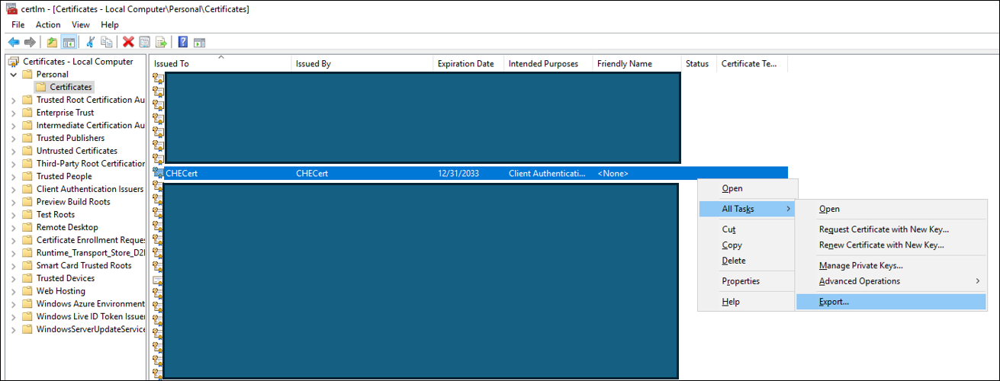
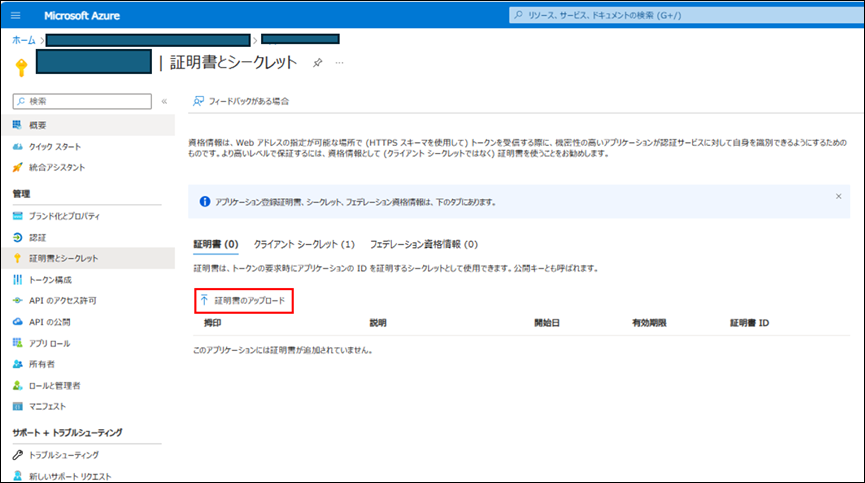
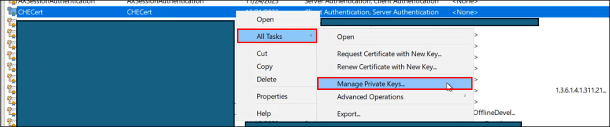
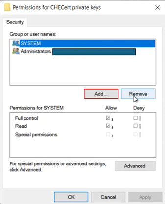
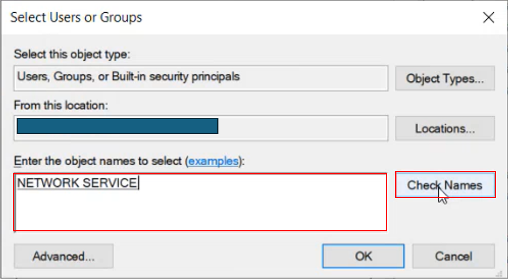
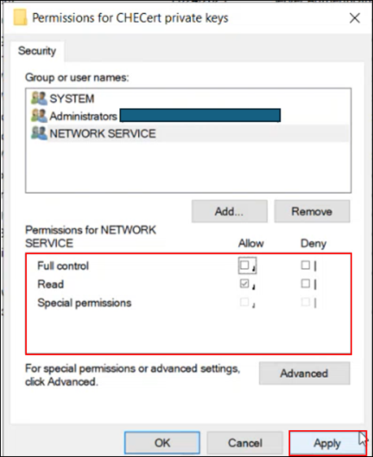
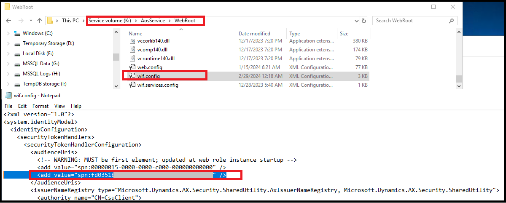

こんにちは、日本マイクロソフトの佐藤です。  
この記事では、新規で配置したクラウドホスト環境で以下のような証明書のエラーが発生した際の対処法をご案内します。
"Cannot Find Thumbprint by Certificatename"


<!-- more -->

> [!NOTE]  
> 2023 年 11 月 15 日以降、Microsoft Entra テナントの証明書は、既定で新しいクラウドホスト環境にインストールされなくなりました。  
>この変更により、2023 年 11 月 15 日以降に構築されたクラウドホスト環境では、外部統合 (例: ユーザーのインポート、Microsoft Entra ID グループのインポート、電子申告 (ER) コンフィギュレーションのインポート) をデフォルトでは使用することができません。  
> 有効化するには、テナントへの証明書のアクセスを構成する必要があるため、本ブログではその手順をご案内いたします。

## 更新履歴
2024 年 3 月 5 日 (火) : SSRS レポートの出力時にエラーが発生した場合の対処法を追加しました。 (福原)

## 検証に用いた製品・バージョン
Dynamics 365 Finance and Operations  
Application version: 10.0.37  
Platform version: PU61  

## 新規で配置したクラウドホスト環境で証明書のエラーが発生した際の対処法
下記の手順で新しいアプリケーションと証明書の登録を設定します。また以下の手順は、下記の公開資料に記載されている手順となっております。

[新しいアプリケーションと証明書の登録をセットアップする - Finance & Operations | Dynamics 365 | Microsoft Learn](https://learn.microsoft.com/ja-jp/dynamics365/fin-ops-core/dev-itpro/dev-tools/secure-developer-vm#set-up-a-new-application-and-certificate-registration)  

1. [Azure Portal](https://portal.azure.com/) から下記の手順でアプリケーションをテナントに作成します。  
[アプリケーションを登録する - Microsoft identity platform | Microsoft Learn](https://learn.microsoft.com/ja-jp/entra/identity-platform/quickstart-register-app#register-an-application)  


1. 証明書を作成し、アプリケーションに追加します。  
発行の手順の例として、LCS の [環境の詳細] 画面から、クラウドホスト環境にリモート デスクトップ接続し、接続先にて Power Shell を起動します。  
Power Shell起動後、下記のコマンドを C:\Users\Admin*** ディレクトリで実行します。  
    ```powershell
    New-SelfSignedCertificate -CertStoreLocation Cert:\LocalMachine\My -DnsName "CHECert" -KeyExportPolicy Exportable -HashAlgorithm sha256 -KeyLength 2048 -KeySpec Signature -Provider "Microsoft Enhanced RSA and AES Cryptographic Provider" -NotBefore (Get-Date -Year 2020 -Month 5 -Day 1) -NotAfter (Get-Date -Year 2033 -Month 12 -Day 31)
    ```
      

1. CHECert という証明書ファイルがクラウドホスト環境のマシン上に作成されますので、リモート デスクトップ接続先で [Manage computer certificate] を開きます。  
  

1. リモートデスクトップ接続先で、CHECert 証明書をエクスポートし、cer ファイルを出力します。  
  

1. 出力した cer ファイルをリモート デスクトップ接続先からローカルの端末にコピーし、[Azure Portal](https://portal.azure.com/) から手順 1 で作成したアプリケーションに cer ファイルをアップロードします。  
  

1. リモート デスクトップ接続先の K:\AosService\webroot\ の下の web.config ファイルで、キーの値をアプリケーション ID/ クライアント ID に置き換え、キーとキーの値を、インストールされている証明書の拇印の値に置き換えます。  
    ```xml
    <add key="Aad.Realm" value="spn:<your application ID>" />
    <add key="Infrastructure.S2SCertThumbprint" value="<certificate thumbprint>" />
    <add key="GraphApi.GraphAPIServicePrincipalCert" value="<certificate thumbprint>" />
    ```

1. 環境 URL をアプリケーションのリダイレクト URI として追加します。詳細は [リダイレクト URI を追加する - Microsoft identity platform | Microsoft Learn](https://learn.microsoft.com/ja-jp/entra/identity-platform/quickstart-register-app#add-a-redirect-uri) を参照してください。  

1. アプリケーションの API アクセス許可を割り当てます。  
    1. [Azure Portal](https://portal.azure.com/) から手順1で作成したアプリケーションにて、[APIのアクセス許可] から下記の項目について設定します。  
        - Dynamics ERP – このアクセス許可は、Dynamics 365 Finance and Operations 環境にアクセスするために必要になります。  
        - Microsoft Graph (User.Read.All および Group.Read.All のアクセス許可) - クラウドホスト環境で、新しくインストールした証明書のネットワーク サービスへの読み取りアクセス権を付与します。  
        
          

    1. リモート デスクトップ接続先のクラウドホスト環境にて、[Manage computer certificate] を開き、CHECert に対し、[Manage Private Key] を設定します。  
      
    1. [Permissions for CHECert private keys] の画面が開いたら、[Add] を選択します。  
      
    1. "NETWORK SERVICE" を入力し、Check Name を選択し、OK を選択します。  
      
    1. 作成された“NETWORK SERVICE” に対し、Read を有効化し、Apply を選択します。  
      

上記の設定により、テナントへの証明書のアクセスを構成できます。  

## 上記の手順の実施後に SSRS レポートの出力時にエラーが発生した場合の対処法
上記の手順を実施しますと該当のクラウドホスト環境にて SSRS レポートの出力時に以下のエラーが発生することを弊社でも確認しており、対処策としまして以下の手順の実施をお客様にはお願い致しております。
> At least one security token in the message could not be validated.

1. クラウドホスト環境の VM 内の K:\AosService\WebRoot 配下の wif.config を開き、作成した Entra ID のアプリケーションのクライアント ID (アプリケーション ID ) を audienceUris の値に追加します。
例は以下となります。
デフォルトで 00000015-0000-0000-c000-000000000000 というものがございますが、その下に追加して頂く必要がございます。
以下の例では fd0351b6-************************** というクライアント ID を追加しています。
        <audienceUris>
          <!-- WARNING: MUST be first element; updated at web role instance startup -->
          <add value="spn:00000015-0000-0000-c000-000000000000" />
          <add value="spn:fd0351b6-**************************" />
        </audienceUris>

また、以下のスクリーンショットもご参考にしていただけますと幸いでございます。
      

2. wif.config の変更後、SSRS レポートが出力できるか確認致します。wif.config の編集後は VM や IIS の再起動は不要でございますが、もし編集後も事象が解消されないようでしたら念のため VM 及び IIS の再起動をご実施いただけますと幸いでございます。


---
## おわりに  

以上、新規で配置したクラウドホスト環境で証明書のエラーが発生した際の対処法をご紹介いたしました。  