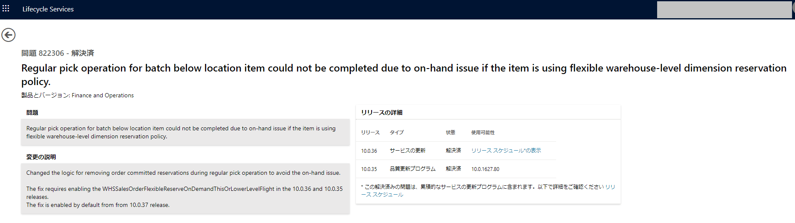

こんにちは、Dynamics ERP サポート チームです。

この記事では、Dynamics 365 Finance and Operations の Issue Search についてご案内いたします。
<!-- more -->

Microsoft は Dynamics 365 Finance and Operaitons (以下 D365FO) の問題について、調査のステータス、修正可否、修正バージョン等の情報を LCS の Issue Search にて公開しております。  
お客様が製品の問題と考えられる事象を見つけた際には、Issue Search にて事象に関するキーワード (例: モジュールの名称、エラー メッセージ) を英語で検索いただくことで類似の事象の有無や修正可否をご確認いただくことが可能でございます。  

例としまして、以下の Issue 822306 では、"ステータス" が解決済みとなっております。  
"問題" には事象の説明が記載されており、"変更の説明" には弊社による修正内容を記載しております。"リリースの詳細" をご確認いただきますと、修正がリリースされるバージョンをご確認いただくことができます。  
本修正はバージョン 10.0.35 に対して品質更新プログラムとして提供し、バージョン 10.0.36 ではサービスの更新 (サービス アップデート) として修正を提供しております。  
      

## よく寄せられる質問 (FAQ)
### Issue の "リリースの詳細" に品質更新プログラムとあるが、どのように環境へ適用することができますか
お客様による手動での品質更新プログラムの適用、弊社による自動での品質更新プログラムの適用の 2 種類がございます。  
以下の弊社のブログ記事にてそれぞれの適用に関してご案内しておりますのでご参考いただけますと幸いです。  
[D365FOで品質更新プログラムを適用する方法](https://jpdynamicserp.github.io/blog/FinOps-Platform/apply-quality-update-d365fo/)  
[Dynamics 365 for Finance and Operations のプロアクティブな品質更新プログラムの適用について](https://jpdynamicserp.github.io/blog/FinOps-Platform/proactive-quality-updates/)

### オープンのままになっている Issue の状態を知ることはできますか
弊社までお問い合わせいただきましたら、Issue の調査状況を弊社内部にて確認し、その結果をご案内いたします。

### オープンのままになっている Issue の調査を早くしてもらうことはできますか
日々、多くの事象をお客様より報告いただいており、お客様の事情や事象の影響範囲等を考慮し、優先度をつけて順次対応しております。  
特定の Issue に関して早期の調査をご要望される場合には、以下の弊社のブログ記事をご参考にして頂き、弊社までビジネスインパクトをご提供いただきますようお願い申し上げます。  
[お客様のビジネスインパクトをお伺いする目的や算出について](https://jpdynamicserp.github.io/blog/information/what-is-business-impact/)

### 既知の Issue のリストを提供してもらうことはできますか
既知の問題を網羅的に把握したい等の理由により、最新バージョンまたは特定バージョンでの既知の全 Issue のリストをご要望いただきますが、Issue Search の公開の有無を問わず、既知の Issue をリストとしてご提供することは承っておりません。  
LCS の Issue Search では、既知の問題に対して修正プログラムを提供している場合、修正をリリースするバージョンをご案内しております。  
一方で、過去に弊社まで報告された問題の影響範囲や優先度の兼ね合いにより、現在まで修正が見送られている数年前の既知の問題もございます。  
上述より、Issue Search では類似の事象をキーワード ベースでご確認いただくことを目的としているため、既知の問題を一括して取得するような API 等の機能は LCS の Issue Search を含め D365FO の機能としてご用意ございません。  

## おわりに
以上、Dynamics 365 Finance and Operations の Issue Search について紹介いたしました。  
