こんにちは、Dynamics ERP サポートチームの木村です。  
この記事では、Dynamics 365 Finance and Operations にて、 発注書を作成する際の一連の流れ (購買処理) について紹介します。  

<!-- more -->
## 更新履歴
2022 年 9 月 21 日 : ブログ公開しました。  
2024 年 7 月 3 日 : 最新バージョンでの検証及び、手順など追記しました。

## 検証に用いた製品・バージョン  
Dynamics 365 Finance and Operations  
Application version : 10.0.40   
Platform version : PU 64  
Legal entity : USMF  

## 発注書作成の一連の流れ

1. [買掛金管理] > [発注書] > [すべての発注書] の順にクリックする  
    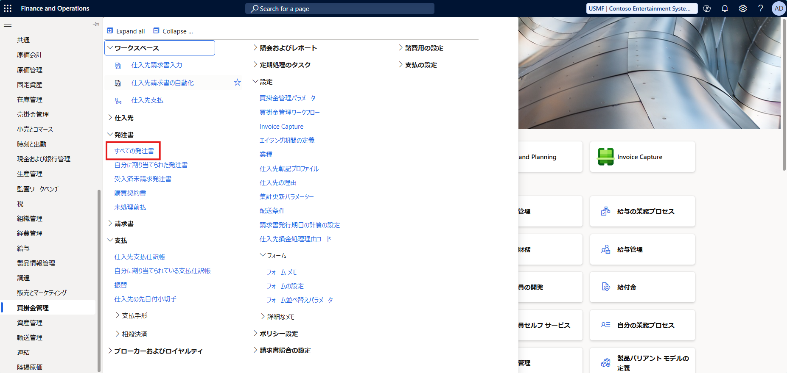  

1. 左上の [新規] をクリックし、[仕入先] を入力する  
    設定が完了した後、[OK] ボタンをクリックする  
    ※ 仕入れ先を入力すると、"名前" 以降は自動入力されます  
    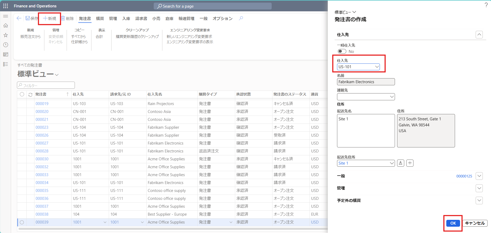  

1. "購買注文明細行" に必要な項目を入力する  
    ※ "品目番号" を入力すると、製品マスタに登録している内容は自動入力されます  
    ※ 倉庫の入力などについては、適宜入力する  
    ※ 明細行の詳細も同様に適宜入力・編集する  
    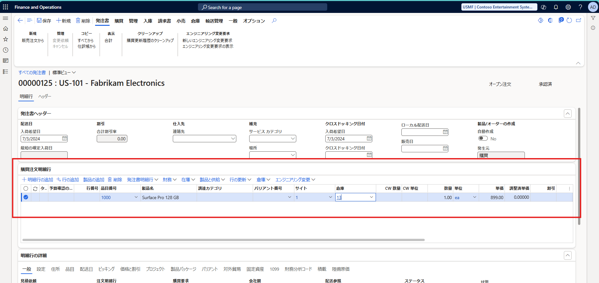  

1. 左上の [保存] ボタンをクリックする  

1. [購買] > [アクション] > [確認] の順にクリックし、発注書の入力内容の確認処理を行う  
    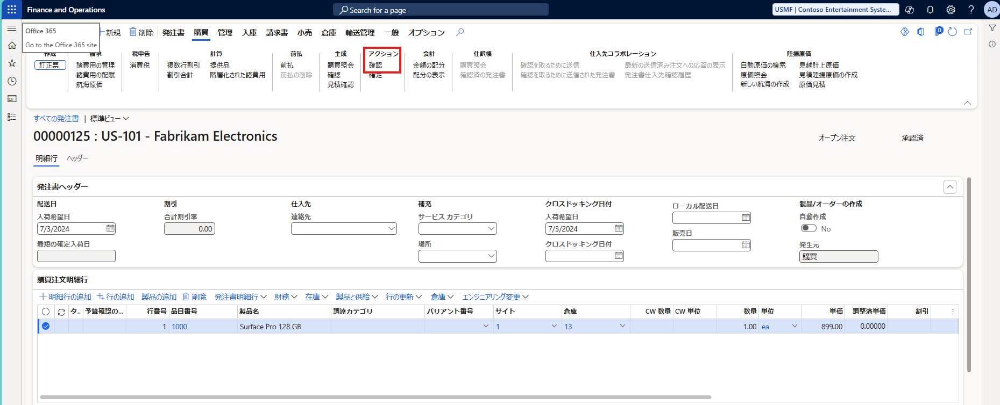  

1. ステータスが "確認済" になっていることを確認する  
    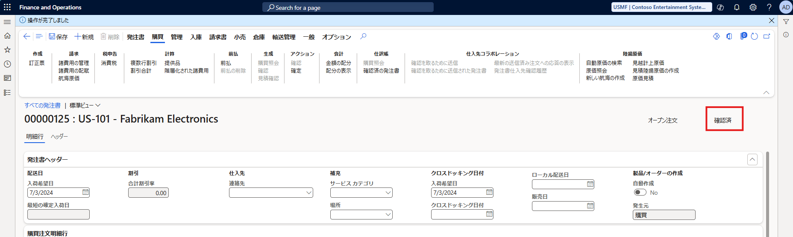  

1. 確認後、[入庫] > [生成] > [製品受領書] の順にクリックする  
    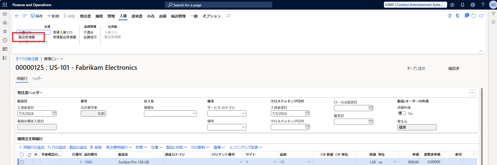  

1. "製品受領書" に任意の [製品受領番号] を入力し、[OK] をクリックする  
    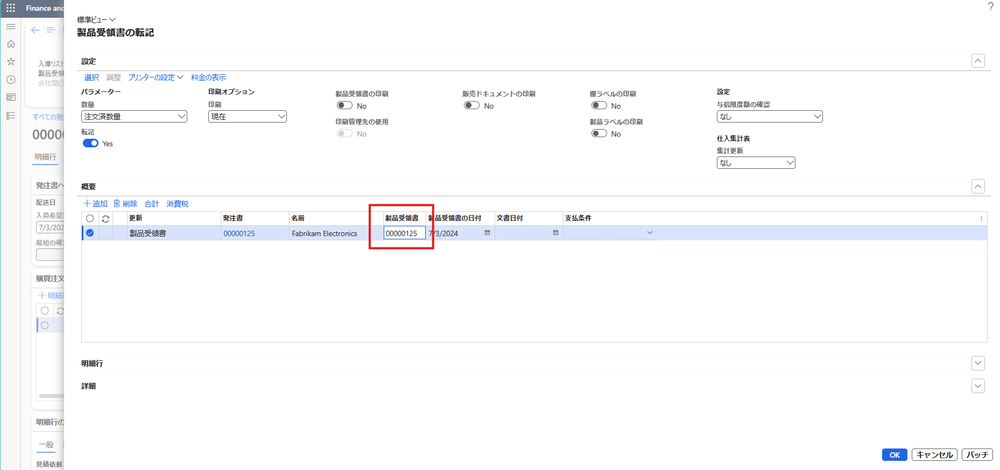  
    処理完了のメッセージが表示され、ステータスが "受取済" となる。  
    ※ 製品受領番号を入力する際は、重複する番号は使用できない  
    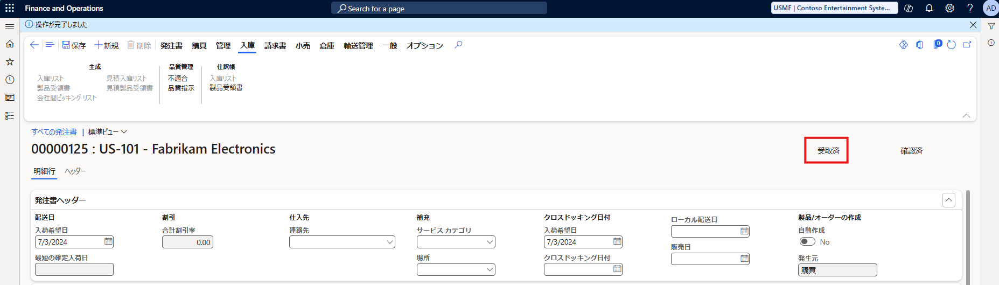  

1. [請求書] > [生成] > [請求書] の順にクリックする  
    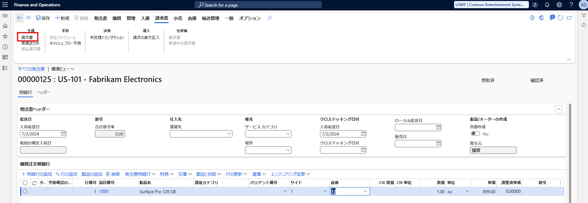  

1. 任意の "請求書の ID" の番号を入力する  
   ※ 請求書の ID を入力する際は、重複する番号は使用できない  
    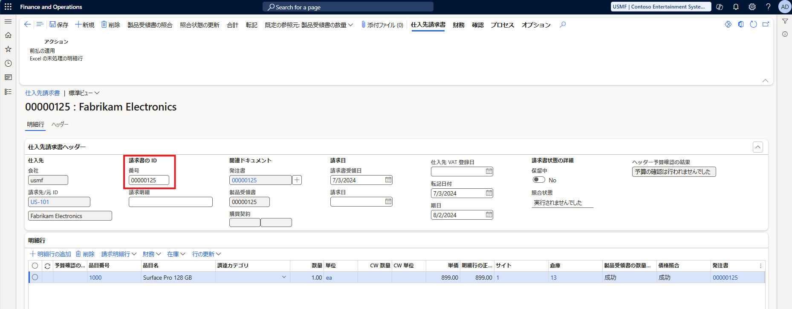  

1. [製品受領書の照合] をクリックし、内容を確認したのち [OK] ボタンをクリックする  
    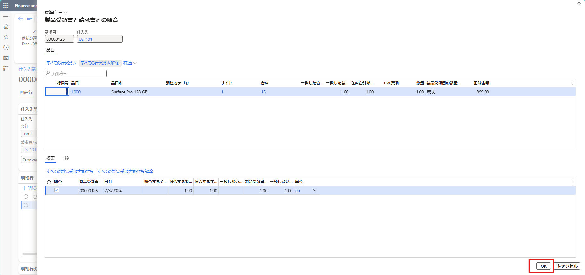  

1. [照合状態の更新] をクリックする  
    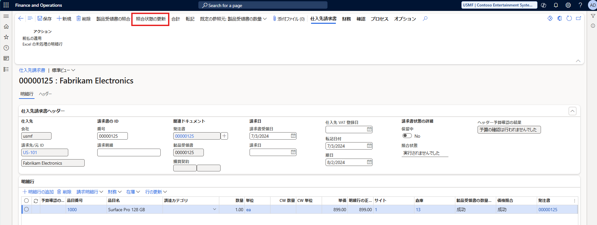  

1. "照合状態" が "成功" となっていることを確認する  
    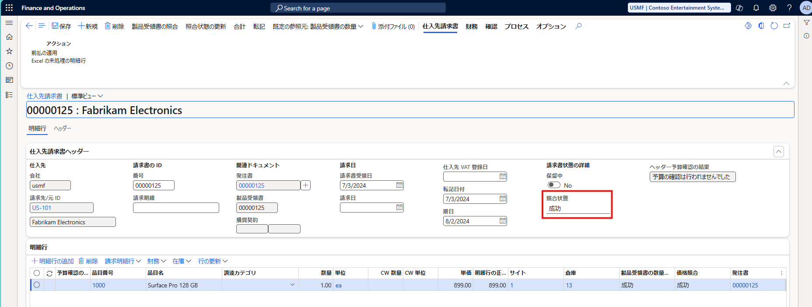  

1. [転記] をクリックする  
    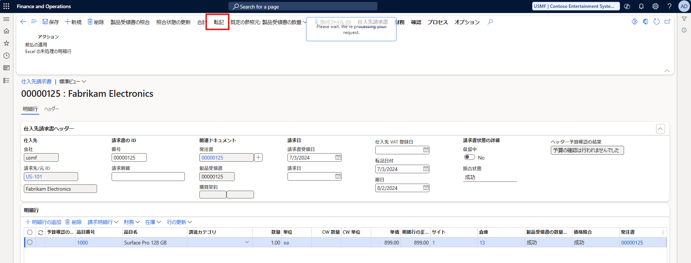  
    メッセージが表示され、ステータスが "請求済" になっていることを確認する  
    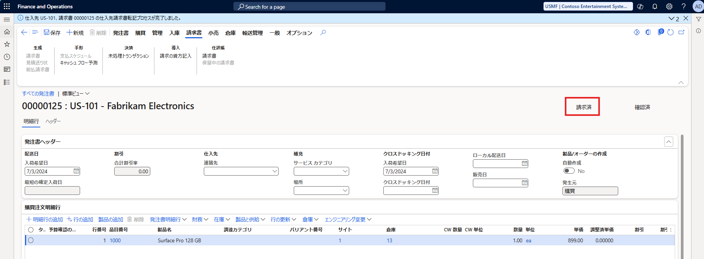  
    ※ 上記 Step.5 の確認処理まで実施した後は、[削除] は非活性となり、請求処理後も非活性のままなので扱いに注意すること  

---
## おわりに  

以上、Dynamics 365 Finance and Operations にて、発注書作成の一連の流れ (購買処理) についてご紹介しました。