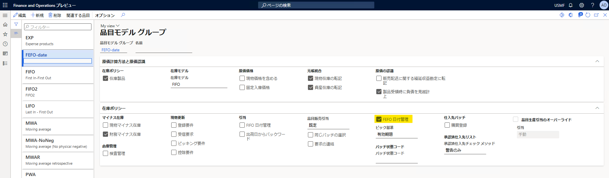
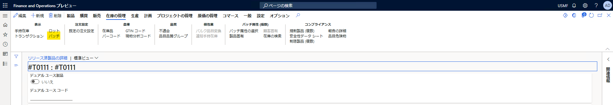
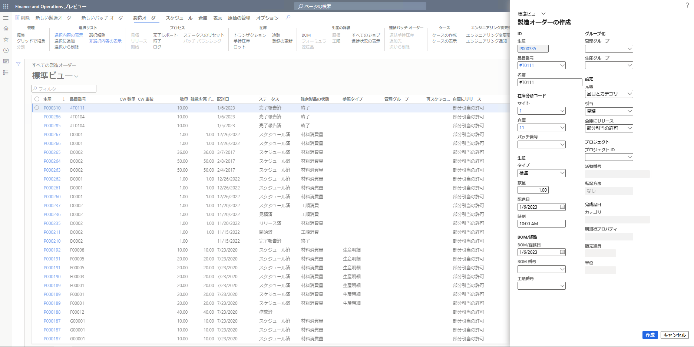
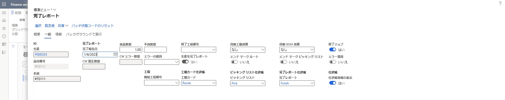
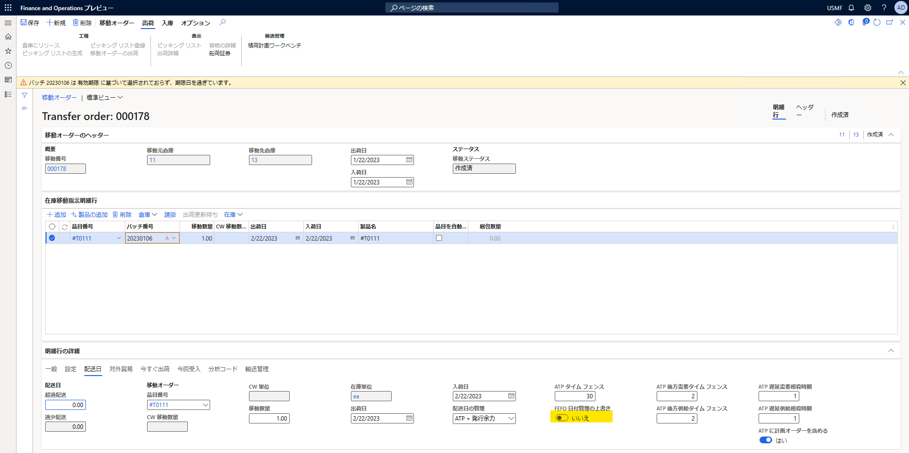

こんにちは、Dynamics ERP サポート チームの細野です。
この記事では、移動オーダーにある項目 "FEFO 日付管理の上書き" の使用方法をご案内いたします。
項目名から動作が想像しづらいため、本記事を参考にしていただけると幸いです。

<!-- more -->
## 検証に用いた製品・バージョン
Dynamics 365 Finance and Operations      
Application version: 10.0.31  
Platform version: PU 55

## 移動オーダー "FEFO 日付管理の上書き" の使用方法
本項目は、移動オーダーの転記時に、有効期限の検証をスキップするかどうかを設定するものです。
"FEFO 日付管理の上書き" が無効である場合は、有効期限を過ぎている在庫を移動することができないように制御されております。
"FEFO 日付管理の上書き" を有効に設定することにより、有効期限を過ぎている在庫を移動することが可能となります。

実際にどのような挙動になるのか、簡易シナリオにて動作を検証した結果を以下におまとめいたします。
ご利用にあたって参考にしていただけると幸いです。

## "FEFO 日付管理" の品目の設定方法
移動オーダーにある項目 "FEFO 日付管理の上書き" は "FEFO 日付管理" が有効である品目に対して利用いただく項目です。
"FEFO 日付管理" が有効である品目の設定方法について、ご説明します。

### 品目モデル グループの設定
1. 在庫管理 > 設定 > 在庫 > 品目モデル グループ に移動する

1. 対象の品目モデル グループ を選択し、在庫ポリシー パネル内の "FEFO 日付管理" を有効にする
    

### 製品の設定
1. 製品情報管理 > 製品 > リリースされた製品 に移動する

1. 対象製品を選択し、詳細画面を開く

1. 対象品目の "追跡用管理分析コード グループ" にてバッチ番号の管理を有効とする
  デモ データ 法人 USMF においては、"Batch-Qty" がご利用いただけます。
    
    

1. "在庫の管理" パネル以下の "有効期限 (日数)" を設定する
    

### バッチ番号の登録
1. リリースされた製品 詳細画面にて、在庫の管理 > 表示 > バッチ をクリックする
    

1. "+新規" をクリックし、以下の画像のように製造日を指定しバッチ番号を登録する
    

1. "保存" をクリックし、"有効期限" 等が補完されることを確認する
    

1. 設定による挙動の違いを確認するため、同様に期限切れのバッチ番号を登録する
    

### 登録したバッチ番号に対応する製造オーダーの登録
1. 生産管理 > 製造オーダー > すべての製造オーダー に移動する

1. "新しい製造オーダー" をクリックし、対象品目の製造オーダーを登録する
    

1. 作成した製造オーダーのステータスを見積、開始へと進める

1. 作成した製造オーダーに対して、バッチ番号を指定し完了レポートを実施する
    
    

## 移動オーダーにて挙動を確認する
1. 在庫管理 > 出庫指示 > 移動オーダー に移動する

1. "+新規" をクリックし移動オーダーを新規作成する

1. 移動元倉庫、移動先倉庫を指定する

1. 対象品目、バッチ番号を指定する

  このとき、以下のようにメッセージが表示されます
    
    メッセージ : バッチ 20230106 は 有効期限 に基づいて選択されておらず、期限日を過ぎています。

1. "明細行の詳細" 以下 "配送日" タブを開き、"FEFO 日付管理の上書き" を "はい" に変更する

1. 再度、バッチ番号を指定し "保存" をクリックする
  "FEFO 日付管理の上書き" の設定を変更したことにより、メッセージは表示されず保存することができます
    

---
## おわりに

以上、移動オーダーにある項目 "FEFO 日付管理の上書き" の使用方法についてご紹介いたしました。  
