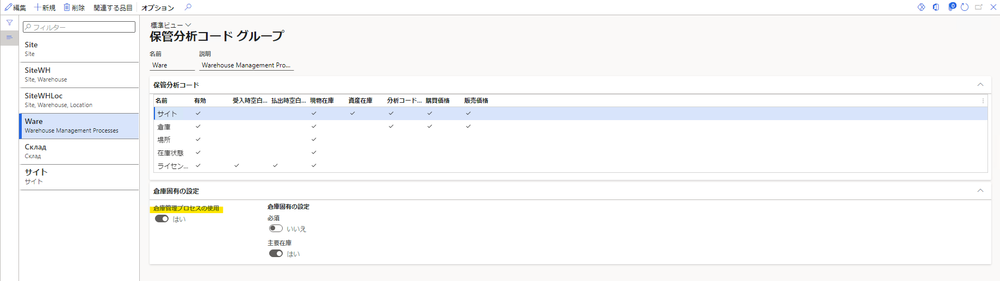
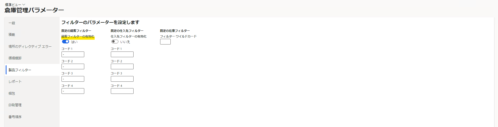
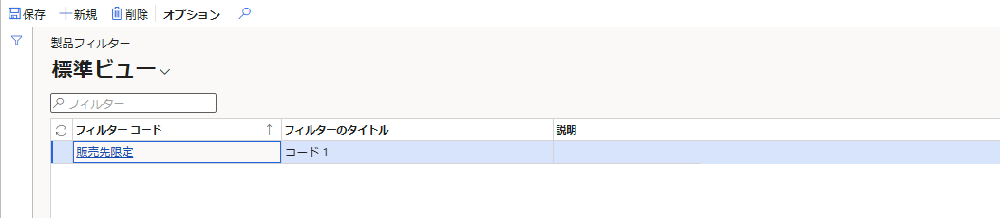
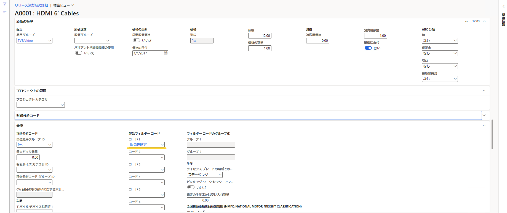
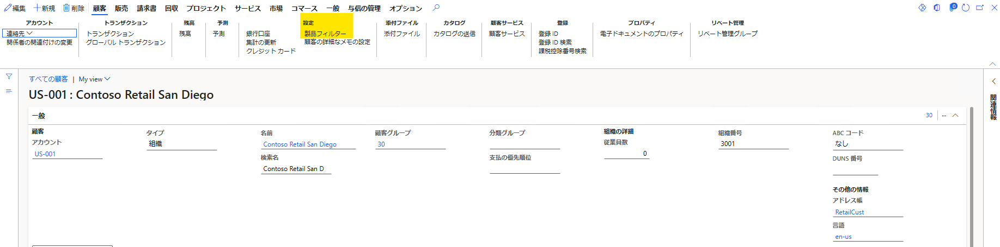
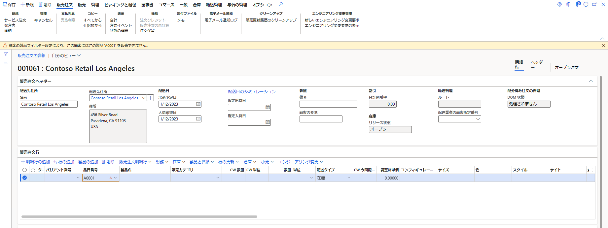
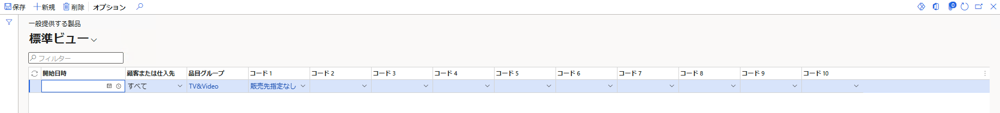
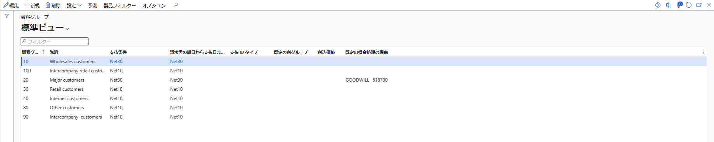

こんにちは、Dynamics ERP サポート チームの細野です。
この記事では、製品フィルターを設定し、特定の顧客にのみ製品の販売を許可する方法をご案内いたします。
発注については、承認仕入先を使用することで対象製品の仕入先を制限することができます。
一方、受注については承認仕入先と同様の機能はございませんが、製品フィルターを設定することで、販売先の顧客を限定することが可能となります。  

<!-- more -->
## 検証に用いた製品・バージョン
Dynamics 365 Finance and Operations      
Application version: 10.0.31  
Platform version: PU 55

## 製品フィルターの設定方法

### 必要条件
製品フィルターを使用するための前提条件は以下の通りです。
1. 製品の保管分析コードグループに対して「倉庫管理プロセスの使用」が「はい」と設定されていること
    製品フィルター コードは、倉庫管理プロセス (WMS) を使用する品目に対してのみ有効になります。
    事前に、製品情報管理 > 設定 > 分析コードとバリアント グループ > 保管分析コード グループ に移動し、「倉庫管理プロセスの使用」オプションが「はい」に設定されている保管分析コード グループを選択または作成します。
    

1. 倉庫管理パラメーターで「顧客フィルター」が有効であること
    倉庫管理 > 設定 > 倉庫管理パラメーター に移動します。 製品フィルター タブで、「顧客フィルターの有効化」オプションを「はい」に設定します。
    

### 製品フィルターの設定
1. 倉庫管理 > 設定 > 製品フィルター > 製品フィルター に移動する

1. アクション ペインで 新規 をクリックし、製品フィルターをグリッドに追加する

1. フィルター タイトルに**コード 1**を選択する

1. フィルター コードに任意の値を入力する

    

### 品目グループおよび製品の設定
1. 製品情報管理 > 製品 > リリースされた製品 に移動する

1. 対象製品を選択し、詳細画面を開く

1. **原価の管理**パネル以下の**品目グループ**項目をクリックし、詳細画面を開く
  

1. **倉庫**パネル以下の**フィルター コード 1 の使用** を有効化する
  

1. 品目グループの詳細画面を閉じ、対象製品の詳細画面に戻る

1. **倉庫**パネル以下の**製品フィルター コード** コード 1 に対し、作成したフィルター コードを指定する
  

### 販売を許可する顧客の設定
1. 売掛金管理 > 顧客 > すべての顧客 に移動する

1. 販売を許可する顧客を選択し、詳細画面を開く

1. 顧客 > 設定 > 製品フィルター をクリックする
  

1. 新規をクリックし、以下画像のようにレコードを追加する
  

## 販売注文にて挙動を確認する
1. 売掛金管理 > 注文 > すべての販売注文 に移動する

1. 販売を許可する設定を実施した顧客を選択し、販売注文を開く

1. 販売明細行に対象製品を指定し、エラー メッセージが表示されないことを確認する
  

1. 異なる顧客を選択し、販売注文を開く

1. 販売明細行に対象製品を指定し、エラー メッセージが表示されることを確認する
  

このように一部の顧客にのみ、販売を許可することができます。

## 補足情報
- すべての顧客に対して一律に販売を許可する場合には、倉庫管理 > 製品フィルター > 一般提供する製品 にて対象のコードをご登録ください
  

- 顧客ごとではなく顧客グループごとに、製品フィルターを設定することも可能です
  

## おわりに
---
以上、製品フィルターを設定し、特定の顧客にのみ製品の販売を許可する方法についてご紹介いたしました。  
